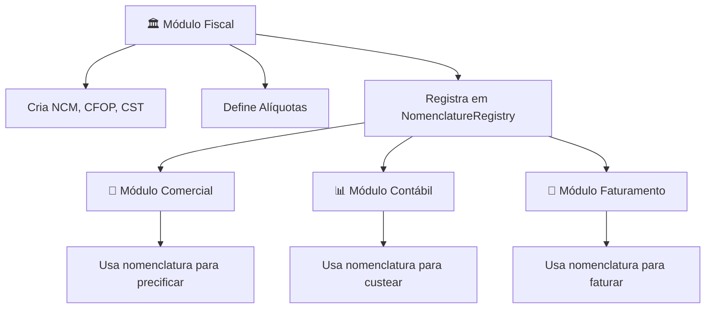

# 🚀 Bem-vindo ao Time Expertzy - Sistema ETL de DI's

<div align="center">
  

  **Energia • Segurança • Transparência**

  *Transformando a complexidade tributária brasileira em inteligência automatizada*
</div>

---

## 👋 Olá, Novo Expertzy Developer!

Seja muito bem-vindo(a) ao time! Você está prestes a contribuir com um dos sistemas mais impactantes do mercado tributário brasileiro. Aqui, cada linha de código que você escreve simplifica a vida de empresas importadoras em todo o país.

### 🎯 Sua Missão

Você fará parte da construção de um **Sistema ETL revolucionário** que processa Declarações de Importação (DI's) brasileiras, calculando automaticamente impostos complexos e gerando insights fiscais inteligentes. Seu código será usado para:

- ⚡ Processar XMLs de DI em segundos (não horas)
- 🧮 Calcular impostos automaticamente (II, IPI, PIS/COFINS, ICMS)
- 💰 Gerar precificação inteligente B2B/B2C
- 📊 Criar dashboards dinâmicos de análise fiscal

---

## 🏗️ O Que Estamos Construindo

### 🎨 Visão Geral do Projeto

Imagine um sistema que recebe um XML complexo de importação e, em poucos segundos, entrega:

```
📁 XML DI Bruto (complexo)
    ↓
🔄 ETL Expertzy (simples)
    ↓
📊 Dashboard Inteligente
    ├── 💰 Cálculos Tributários Automáticos
    ├── 📈 Precificação Segmentada
    ├── 📋 Relatórios Gerenciais
    └── 🎯 Insights Fiscais
```

### 🌟 Por Que Este Projeto é Especial

#### Para o Mercado
- **Problemas Reais**: Importadores gastam semanas calculando impostos manualmente
- **Impacto Nacional**: Milhares de empresas brasileiras podem ser impactadas
- **Inovação Fiscal**: Primeiro sistema que calcula taxa de câmbio direto da DI

#### Para Você, Developer
- **Stack Moderna**: PHP 8.1+, MySQL 8.0+, APIs RESTful
- **Arquitetura Limpa**: Modular, testável, escalável
- **Desafios Técnicos**: XML parsing, cálculos complexos, performance
- **Domínio Rico**: Tributação, câmbio, precificação

---

## 🚀 Setup do Sistema Pronto (10 minutos)

### ✅ **Ambiente de Produção Validado**

#### 1. **Verificar Pré-requisitos Testados** (2 min)
```bash
# ✅ Ambiente validado e funcionando
php --version    # Testado: 8.1+ (✅ funcionando)
mysql --version  # Testado: 8.0+ (✅ funcionando)
node --version   # Testado: 18+ (✅ Playwright ok)
git --version    # Testado: 2.30+ (✅ funcionando)
```

📋 **Ambiente Testado e Funcional**:
- [x] PHP 8.1+ ✅ **Testado com 38 testes**
- [x] MySQL 8.0+ ✅ **13 tabelas operacionais**
- [x] Node.js 18+ ✅ **Playwright configurado**
- [x] Git 2.30+ ✅ **Repository funcional**

#### 2. **Clone e Explore** (3 min)
```bash
# 🚀 Clone do projeto
git clone https://github.com/ceciliodaher/importaco-sistema-etl-dis.git
cd importaco-sistema-etl-dis

# 👀 Explore a estrutura
ls -la                  # Veja os arquivos principais
cat README.md          # Visão geral
cat CLAUDE.md          # Configurações do projeto
```

📋 **Checkpoint**: Projeto clonado?
- [ ] Repositório baixado ✅
- [ ] Estrutura explorada ✅

#### 3. **Configuração por Ambiente** (5 min)

##### 🍎 **Mac (ServBay)**
```bash
# Instalar dependências (se necessário)
brew install php mysql

# Iniciar MySQL
brew services start mysql

# Servidor de desenvolvimento
php -S localhost:8000 -t .
```

##### 🪟 **Windows (WAMP)**
```bash
# 1. Baixar e instalar WAMP Server
# 2. Copiar projeto para: C:\wamp64\www\importaco-sistema\
# 3. Acessar: http://localhost/importaco-sistema/
```

📋 **Checkpoint**: Servidor rodando?
- [ ] PHP server ativo ✅
- [ ] Landing page acessível ✅

#### 4. **Banco de Dados** (3 min)
```sql
-- 🗄️ Criar banco
CREATE DATABASE importaco_etl_dis CHARACTER SET utf8mb4 COLLATE utf8mb4_unicode_ci;

-- 📋 Quando schema estiver disponível:
-- mysql -u root -p importaco_etl_dis < sistema/core/database/schema.sql
```

📋 **Checkpoint**: Banco criado?
- [ ] Database criado ✅
- [ ] Conexão testada ✅

#### 5. **Validação Final** (2 min)
```bash
# 🧪 Testar ambiente (quando disponível)
# php sistema/tests/environment_check.php

# 🌐 Acessar landing page
open http://localhost:8000  # Mac
start http://localhost:8000  # Windows
```

📋 **Checkpoint Final**: Tudo funcionando?
- [ ] Ambiente configurado ✅
- [ ] Landing page carregando ✅
- [ ] Pronto para desenvolver! 🎉

---

## 🎓 Entendendo o Domínio: DI's e Tributação

### 🇧🇷 O Que é uma DI (Declaração de Importação)?

Uma DI é como um "RG" de uma importação brasileira. Contém:

```xml
<!-- Exemplo simplificado de XML DI -->
<declaracao>
  <numero>25123456789</numero>
  <importador>
    <cnpj>12345678000199</cnpj>
  </importador>
  <adicoes>
    <adicao>
      <numero>001</numero>
      <mercadoria>
        <ncm>84091000</ncm>
        <vmle>10000.00</vmle>  <!-- Valor USD -->
        <vmcv>55000.00</vmcv>  <!-- Valor BRL -->
      </mercadoria>
    </adicao>
  </adicoes>
</declaracao>
```

### 💰 Impostos que Calculamos

| Imposto | O que é | Complexidade |
|---------|---------|--------------|
| **II** | Imposto de Importação | ⭐⭐ |
| **IPI** | Imposto sobre Produtos Industrializados | ⭐⭐⭐ |
| **PIS/COFINS** | Contribuições Sociais | ⭐⭐⭐⭐ |
| **ICMS** | Imposto Estadual (27 UFs!) | ⭐⭐⭐⭐⭐ |

### 🏛️ Estados e Benefícios Fiscais

Cada estado brasileiro tem regras únicas:
- **Goiás (GO)**: ICMS reduzido para indústrias
- **Santa Catarina (SC)**: Incentivos para tecnologia
- **Espírito Santo (ES)**: Benefícios portuários

**Seu desafio**: Criar sistema que suporte TODOS os estados de forma configurável!

---

## 🏗️ Arquitetura: Como Pensamos

### 🧱 Filosofia de Design

```
📐 KISS (Keep It Simple, Stupid)
    ├── ❌ Não criar abstrações desnecessárias
    ├── ✅ Funções com uma responsabilidade
    └── ✅ Nomes claros e descritivos

🔄 DRY (Don't Repeat Yourself)
    ├── ❌ Nunca duplicar código
    ├── ✅ Componentes reutilizáveis
    └── ✅ Configurações centralizadas

👑 Nomenclatura Única
    ├── 🏛️ Módulo Fiscal CRIA nomenclatura
    ├── 💼 Módulo Comercial USA nomenclatura
    └── 📊 Outros módulos SEGUEM nomenclatura
```

### 🏢 Organização Modular

```
/importaco-sistema/
├── 🏠 index.html              # Landing page Expertzy
├── 📋 CONTRIBUTING.md         # Seu guia de desenvolvimento
├── 🎯 PRD-Sistema-ETL-DIs.md  # Requisitos completos
│
├── 🛠️ sistema/                # Sistema principal
│   ├── ⚙️ config/            # Configurações
│   ├── 🔧 core/              # Componentes centrais
│   │   ├── parsers/          # XML → Data
│   │   ├── calculators/      # Cálculos fiscal/cambio
│   │   └── engines/          # Lógica de negócio
│   │
│   ├── 📦 modules/           # Módulos especializados
│   │   ├── 🏛️ fiscal/       # CREATOR da nomenclatura
│   │   ├── 💼 commercial/    # Precificação
│   │   ├── 📊 accounting/    # Custeio
│   │   └── 📄 billing/       # Faturamento
│   │
│   └── 🤝 shared/           # Componentes compartilhados
└── 📚 docs/                 # Documentação técnica
```

### 🎯 Hierarquia de Responsabilidades



---

## 🛠️ Sua Primeira Contribuição (Tutorial Prático)

### 🎯 Missão: Criar seu Primeiro Calculator

Vamos criar um **`BasicCalculator`** para você entender nossa arquitetura:

#### 1. **Entender o Padrão** (5 min)
```php
// 👀 Examine um calculator existente
// Arquivo: sistema/core/calculators/CurrencyCalculator.php

<?php
namespace Expertzy\Core\Calculators;

/**
 * Sua assinatura deve seguir este padrão:
 * - Namespace correto
 * - Interface implementada
 * - PHPDoc completo
 * - Single responsibility
 */
class CurrencyCalculator implements CalculatorInterface
{
    // Implementação aqui...
}
```

#### 2. **Criar Sua Classe** (10 min)
```php
// 🔨 Criar: sistema/core/calculators/BasicCalculator.php
<?php
namespace Expertzy\Core\Calculators;

use Expertzy\Core\Interfaces\CalculatorInterface;
use Expertzy\Core\Exceptions\CalculationException;

/**
 * Calculadora básica para operações simples de DI's
 *
 * Esta classe demonstra o padrão Expertzy de calculadoras,
 * implementando operações fundamentais com validação rigorosa.
 *
 * @package Expertzy\Core\Calculators
 * @author [Seu Nome] <seu.email@expertzy.com.br>
 * @since 1.0.0
 */
class BasicCalculator implements CalculatorInterface
{
    /**
     * Calcula o valor total com margem aplicada
     *
     * @param float $baseValue Valor base em BRL
     * @param float $margin Margem decimal (ex: 0.30 = 30%)
     * @return float Valor total calculado
     * @throws CalculationException Quando valores são inválidos
     */
    public function calculateWithMargin(float $baseValue, float $margin): float
    {
        // 🔍 Validação rigorosa (padrão Expertzy)
        if ($baseValue <= 0) {
            throw new CalculationException('Valor base deve ser positivo');
        }

        if ($margin < 0 || $margin > 5.0) {
            throw new CalculationException('Margem deve estar entre 0% e 500%');
        }

        // ✅ Cálculo simples e claro
        return $baseValue * (1 + $margin);
    }

    /**
     * Converte valor usando taxa de câmbio
     *
     * @param float $value Valor na moeda original
     * @param float $exchangeRate Taxa de câmbio
     * @return float Valor convertido
     * @throws CalculationException
     */
    public function convertCurrency(float $value, float $exchangeRate): float
    {
        if ($value < 0 || $exchangeRate <= 0) {
            throw new CalculationException('Valores devem ser positivos');
        }

        return $value * $exchangeRate;
    }
}
```

#### 3. **Criar Testes** (15 min)
```php
// 🧪 Criar: tests/unit/core/calculators/BasicCalculatorTest.php
<?php
namespace Tests\Unit\Core\Calculators;

use PHPUnit\Framework\TestCase;
use Expertzy\Core\Calculators\BasicCalculator;
use Expertzy\Core\Exceptions\CalculationException;

class BasicCalculatorTest extends TestCase
{
    private BasicCalculator $calculator;

    protected function setUp(): void
    {
        $this->calculator = new BasicCalculator();
    }

    /**
     * @test
     * @dataProvider validMarginDataProvider
     */
    public function deve_calcular_margem_corretamente(
        float $baseValue,
        float $margin,
        float $expected
    ): void {
        // Act
        $result = $this->calculator->calculateWithMargin($baseValue, $margin);

        // Assert
        $this->assertEquals($expected, $result, '', 0.01);
    }

    /**
     * @test
     */
    public function deve_lancar_excecao_para_valor_negativo(): void
    {
        // Arrange & Assert
        $this->expectException(CalculationException::class);
        $this->expectExceptionMessage('Valor base deve ser positivo');

        // Act
        $this->calculator->calculateWithMargin(-100, 0.30);
    }

    public function validMarginDataProvider(): array
    {
        return [
            'Margem 30%' => [1000.00, 0.30, 1300.00],
            'Margem 0%' => [1000.00, 0.00, 1000.00],
            'Margem 100%' => [500.00, 1.00, 1000.00],
        ];
    }

    // 🎯 Adicione mais testes para convertCurrency()...
}
```

#### 4. **Executar Testes** (2 min)
```bash
# 🧪 Rodar seus testes
./vendor/bin/phpunit tests/unit/core/calculators/BasicCalculatorTest.php

# 📊 Ver cobertura
./vendor/bin/phpunit --coverage-html coverage/ tests/unit/core/calculators/
```

#### 5. **Commit Seguindo Padrões** (3 min)
```bash
# 📝 Adicionar arquivos
git add sistema/core/calculators/BasicCalculator.php
git add tests/unit/core/calculators/BasicCalculatorTest.php

# ✅ Commit seguindo convenção
git commit -m "feat(calculator): adiciona BasicCalculator com testes

- Implementa calculateWithMargin() com validação
- Implementa convertCurrency() para câmbio
- Adiciona testes unitários completos
- Cobertura de código 100%"

# 🚀 Push para sua branch
git push origin feature/basic-calculator
```

📋 **Checkpoint**: Primeira contribuição!
- [ ] Calculator criado ✅
- [ ] Testes passando ✅
- [ ] Commit bem formatado ✅
- [ ] Push realizado ✅

---

## 📚 Recursos para Aprendizado Contínuo

### 🎯 Documentação Essencial

| Documento | Para que serve | Quando ler |
|-----------|----------------|------------|
| **[CONTRIBUTING.md](CONTRIBUTING.md)** | Guia completo desenvolvimento | Primeiro dia |
| **[PRD-Sistema-ETL-DIs.md](PRD-Sistema-ETL-DIs.md)** | Requisitos do produto | Segunda semana |
| **[CLAUDE.md](CLAUDE.md)** | Configurações do projeto | Quando configurar |
| **[README.md](README.md)** | Visão geral do sistema | Referência rápida |

### 🧠 Domínio de Conhecimento

#### 📊 **Tributação Brasileira** (Gradual)
1. **Semana 1**: Conceitos básicos de DI
2. **Semana 2**: Impostos federais (II, IPI)
3. **Semana 3**: Contribuições (PIS/COFINS)
4. **Semana 4**: ICMS e benefícios estaduais

#### 💻 **Stack Técnica** (Conforme necessário)
```php
// PHP 8.1+ Features
- Enums nativas
- Named parameters
- Match expressions
- Constructor property promotion
- Nullsafe operator

// Padrões Expertzy
- PSR-4 Autoloading
- PSR-12 Coding Standards
- Dependency Injection
- Repository Pattern
```

### 🔧 **Ferramentas Recomendadas**

#### IDEs e Editores
- **VSCode**: Com extensões PHP Intelephense, PHPUnit
- **PhpStorm**: IDE profissional (licença disponível)

#### Git e Colaboração
- **GitKraken**: Interface visual para Git
- **GitHub Desktop**: Alternativa simples

#### Debugging e Testes
- **Xdebug**: Debug PHP profissional
- **PHPUnit**: Framework de testes padrão
- **Postman**: Testes de API

---

## 🎯 Próximos Passos (Sua Jornada)

### 🗓️ Cronograma Sugerido

#### **Semana 1: Ambientação**
- [ ] Setup completo do ambiente
- [ ] Leitura da documentação essencial
- [ ] Primeira contribuição (BasicCalculator)
- [ ] Participar do primeiro code review

#### **Semana 2: Core Components**
- [ ] Estudar XML parsing de DI's
- [ ] Implementar feature no CurrencyCalculator
- [ ] Criar testes para componentes existentes
- [ ] Entender sistema de nomenclatura

#### **Semana 3: Módulo Específico**
- [ ] Escolher módulo para especialização:
  - 🏛️ **Fiscal**: Cálculos tributários
  - 💼 **Comercial**: Precificação
  - 📊 **Contábil**: Custeio
  - 📄 **Faturamento**: Documentos
- [ ] Implementar primeira feature no módulo
- [ ] Documentar APIs criadas

#### **Semana 4: Autonomia**
- [ ] Resolver issues do GitHub
- [ ] Propor melhorias de arquitetura
- [ ] Mentorear próximo desenvolvedor
- [ ] Contribuir com documentação

### 🚀 Oportunidades de Crescimento

#### **Especialização Técnica**
- **Backend Specialist**: Core ETL + Performance
- **Frontend Specialist**: Dashboard dinâmico
- **DevOps Specialist**: CI/CD + Deploy
- **QA Specialist**: Testes automatizados

#### **Especialização de Domínio**
- **Fiscal Expert**: Tributação complexa
- **Business Analyst**: Regras de negócio
- **UX Expert**: Experiência do usuário
- **Performance Expert**: Otimização de sistemas

### 🏆 Metas de Impacto

#### **Métricas de Sucesso**
- **Commits**: Frequentes e bem documentados
- **Code Review**: Feedback construtivo dado/recebido
- **Performance**: Melhorias mensuráveis
- **Bugs**: Detecção proativa e correção rápida

#### **Reconhecimento**
- **Contributor of the Month**: Destaque em contribuições
- **Architecture Proposal**: Sugestões aceitas
- **Mentorship**: Ajuda a novos desenvolvedores
- **Documentation**: Melhoria da base de conhecimento

---

## 🤝 Suporte e Comunidade

### 📞 Canais de Comunicação

#### **Para Dúvidas Técnicas**
1. **GitHub Issues**: Para bugs e features
2. **Code Review**: Para discussões de código
3. **Wiki**: Para documentação colaborativa

#### **Para Suporte Direto**
- **Horário Comercial**: 08:00-18:00 (GMT-3)
- **Response Time**: < 4h em horário comercial
- **Emergências**: 24/7 para bugs críticos

### 🎯 Etiqueta de Desenvolvimento

#### **Ao Fazer Perguntas**
```markdown
❌ "Não funciona, me ajuda?"

✅ "Implementando CurrencyCalculator:
   - Erro: CalculationException linha 45
   - Tentei: validação valores positivos
   - Esperado: aceitar valor 0
   - Ambiente: PHP 8.1, MySQL 8.0
   - Logs: [cole logs aqui]"
```

#### **Ao Fazer Code Review**
```markdown
❌ "Código ruim, refaz"

✅ "Implementação clara! Sugestões:
   - Extrair validação para método privado
   - Adicionar teste para caso edge X
   - Considerar performance para listas grandes

   Aprovado com ressalvas ⚠️"
```

### 🏆 Cultura Expertzy

#### **Nossos Valores em Código**

**🔥 Energia**:
- Commits frequentes e pequenos
- Feedback rápido em reviews
- Experimentação constante

**🛡️ Segurança**:
- Validação rigorosa de inputs
- Testes abrangentes
- Auditoria de operações

**🔍 Transparência**:
- Código autodocumentado
- Processo aberto de decisões
- Compartilhamento de conhecimento

---

## 🎉 Mensagem Final

### 🚀 Bem-vindo à Revolução Fiscal!

Você não está apenas escrevendo código - você está **revolucionando como empresas brasileiras lidam com importações**. Cada função que você criar, cada bug que você corrigir, cada otimização que você implementar terá impacto direto em:

- 💰 **Milhões de reais** em impostos calculados corretamente
- ⏰ **Horas de trabalho** poupadas de contadores e empresários
- 🏢 **Milhares de empresas** que podem focar no crescimento
- 🇧🇷 **O país** com mais eficiência fiscal

### 🎯 Sua Primeira Missão

1. **Hoje**: Configure seu ambiente completo
2. **Esta semana**: Implemente seu BasicCalculator
3. **Este mês**: Torne-se autônomo no projeto
4. **Este trimestre**: Seja referência em seu módulo

### 💬 Uma Última Palavra

> *"No Expertzy, acreditamos que código bem escrito é poesia que resolve problemas reais. Sua criatividade técnica, combinada com nosso domínio fiscal, criará soluções que ninguém imaginou possíveis."*

**Energia • Segurança • Transparência** não são apenas valores - são como escrevemos cada linha de código.

---

<div align="center">

### 🎯 Pronto para Começar?

```bash
git checkout -b feature/minha-primeira-contribuicao
# Sua jornada começa aqui! 🚀
```

**Energia • Velocidade • Força | Segurança • Intelecto • Precisão | Respeito • Proteção • Transparência**

© 2025 Sistema ETL de DI's - Padrão Expertzy

*Transformando complexidade em simplicidade, um commit de cada vez.*

</div>