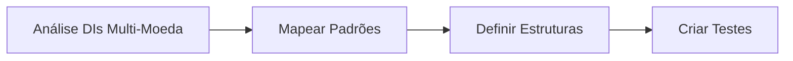

# PRD - Product Requirements Document
## Suporte a Múltiplas Taxas de Câmbio no Sistema DI

**Versão:** 1.0  
**Data:** 2025-08-30  
**Autor:** Sistema Expertzy  
**Status:** Em Análise

---

## 1. Resumo Executivo

### 1.1 Problema Identificado
O sistema atual possui estrutura básica para múltiplas moedas, mas apresenta limitações ao processar DIs complexas com diferentes moedas para mercadorias e fretes, como identificado na DI 2518173187 que utiliza USD para mercadorias e INR (Rúpia Indiana) para frete.

### 1.2 Solução Proposta
Aprimorar o módulo `DIProcessor.js` para suportar completamente múltiplas taxas de câmbio, com mapeamento preciso entre moedas e taxas, validação robusta e interface adequada para visualização.

### 1.3 Impacto Esperado
- ✅ Processamento correto de 100% das DIs com múltiplas moedas
- ✅ Redução de erros de cálculo relacionados a câmbio
- ✅ Maior transparência nas conversões de moeda
- ✅ Conformidade total com SISCOMEX

---

## 2. Análise Técnica Atual

### 2.1 Capacidades Existentes ✅

#### Estrutura de Código Implementada:
```javascript
// Métodos já existentes em DIProcessor.js
- processarMultiplasMoedas() // Linha 599-633
- extrairTaxasCambio()       // Linha 469-493
- identificarMoedasETaxas()  // Linha 498-548
- detectarMoedaVmleVmld()    // Linha 553-577
- validarConversoes()        // Linha 638-698
```

#### Mapeamento de Moedas:
- 18+ moedas cadastradas no `CODIGOS_MOEDA_RFB`
- Suporte a USD (220), EUR (978), INR (860), CNY (790), etc.

### 2.2 Limitações Identificadas ⚠️

| Área | Limitação | Impacto |
|------|-----------|---------|
| **Associação Taxa-Moeda** | Mapeia por índice de array | Pode associar taxa errada à moeda |
| **Taxa por Adição** | Uma única taxa_cambio | Não diferencia frete de mercadoria |
| **Validação** | Apenas VMLE e frete total | Não valida todas as combinações |
| **Interface** | Mostra apenas uma taxa | Usuário não vê múltiplas conversões |

### 2.3 Caso de Teste: DI 2518173187

```xml
<!-- Exemplo Real do XML -->
<informacaoComplementar>
  TAXA CAMBIAL.....: 5,392800 0,061640
</informacaoComplementar>

<condicaoVendaMoedaCodigo>220</condicaoVendaMoedaCodigo> <!-- USD -->
<freteMoedaNegociadaCodigo>860</freteMoedaNegociadaCodigo> <!-- INR -->
```

**Conversões Necessárias:**
- VMLE: USD 847.53 × 5.392800 = R$ 4,570.56 ✓
- Frete: INR 4,034.00 × 0.061640 = R$ 248.66 ✓

---

## 3. Requisitos Funcionais

### 3.1 RF001 - Detecção de Múltiplas Moedas
**Como** sistema  
**Quero** identificar todas as moedas usadas na DI  
**Para** aplicar a taxa de câmbio correta a cada campo  

**Critérios de Aceite:**
- [ ] Detectar moeda da condição de venda (VMLE/VMLD)
- [ ] Detectar moeda do frete
- [ ] Detectar moeda do seguro
- [ ] Detectar moedas específicas por adição

### 3.2 RF002 - Associação Taxa-Moeda
**Como** sistema  
**Quero** associar cada taxa à sua moeda correspondente  
**Para** realizar conversões precisas  

**Critérios de Aceite:**
- [ ] Validar taxa usando valores do XML
- [ ] Calcular taxa implícita (BRL/Moeda)
- [ ] Comparar com tolerância de 1%
- [ ] Registrar log de associações

### 3.3 RF003 - Cálculo Multi-Moeda por Adição
**Como** calculador  
**Quero** aplicar diferentes taxas em uma mesma adição  
**Para** converter corretamente cada componente de custo  

**Critérios de Aceite:**
- [ ] VMLE com taxa específica
- [ ] Frete com taxa específica
- [ ] Seguro com taxa específica
- [ ] Consolidação em BRL

### 3.4 RF004 - Interface Multi-Moeda
**Como** usuário  
**Quero** visualizar todas as taxas e conversões  
**Para** entender e validar os cálculos  

**Critérios de Aceite:**
- [ ] Exibir tabela de taxas de câmbio
- [ ] Mostrar moeda e taxa por campo
- [ ] Destacar conversões na memória de cálculo
- [ ] Exportar detalhamento multi-moeda

---

## 4. Requisitos Não-Funcionais

### 4.1 Performance
- Processamento de DI com múltiplas moedas < 2 segundos
- Validação de conversões < 500ms

### 4.2 Confiabilidade
- Taxa de acerto de associação moeda-taxa > 99%
- Tolerância de cálculo < 0.01%

### 4.3 Manutenibilidade
- Código modular com funções específicas
- Logs detalhados para debugging
- Testes unitários para cada conversão

### 4.4 Usabilidade
- Interface clara mostrando origem das taxas
- Tooltips explicativos sobre conversões
- Relatórios com detalhamento de câmbio

---

## 5. Workflow de Implementação

### Fase 1: Análise e Preparação (2 dias)


**Entregáveis:**
- [ ] Documento com padrões de DIs multi-moeda
- [ ] Suite de testes com DIs reais
- [ ] Estrutura de dados atualizada

### Fase 2: Implementação Core (3 dias)

#### 2.1 Aprimorar Detecção de Taxas
```javascript
// Melhorar extrairTaxasCambio()
function extrairTaxasCambio(infoComplementar) {
    // Implementar regex mais robusto
    // Suportar múltiplos formatos
    // Retornar array estruturado
}
```

#### 2.2 Melhorar Associação Moeda-Taxa
```javascript
// Novo método: associarTaxasPorValidacao()
function associarTaxasPorValidacao(moedas, taxas, valoresXML) {
    // Calcular taxa implícita de cada campo
    // Comparar com taxas extraídas
    // Associar por melhor match
}
```

#### 2.3 Implementar Multi-Taxa por Adição
```javascript
// Atualizar extractAdicao()
function extractAdicao(adicaoNode) {
    // Separar taxas por componente
    adicao.taxas = {
        vmle: taxaVMLE,
        frete: taxaFrete,
        seguro: taxaSeguro
    };
}
```

### Fase 3: Interface e Visualização (2 dias)

#### 3.1 Componente de Taxas de Câmbio
```html
<!-- Novo componente no modal -->
<div class="exchange-rates-panel">
    <h6>Taxas de Câmbio Aplicadas</h6>
    <table class="table">
        <tr><td>USD→BRL</td><td>5.392800</td><td>VMLE</td></tr>
        <tr><td>INR→BRL</td><td>0.061640</td><td>Frete</td></tr>
    </table>
</div>
```

#### 3.2 Atualizar Memória de Cálculo
- Adicionar seção de conversões
- Mostrar cálculo detalhado por moeda
- Destacar qual taxa foi usada

### Fase 4: Validação e Testes (2 dias)

#### 4.1 Testes Unitários
```javascript
describe('Multi-Currency Support', () => {
    test('Detecta múltiplas taxas', () => {});
    test('Associa corretamente USD e INR', () => {});
    test('Calcula conversões precisas', () => {});
    test('Valida com tolerância 1%', () => {});
});
```

#### 4.2 Testes de Integração
- DI com 1 moeda (caso simples)
- DI com 2 moedas (USD + INR)
- DI com 3+ moedas (caso complexo)
- DI com moedas não mapeadas

### Fase 5: Deploy e Monitoramento (1 dia)

#### 5.1 Checklist de Deploy
- [ ] Backup do código atual
- [ ] Deploy em ambiente de teste
- [ ] Validação com DIs reais
- [ ] Deploy em produção
- [ ] Monitoramento pós-deploy

---

## 6. Plano de Rollback

### Condições para Rollback:
- Taxa de erro > 5% nas conversões
- Performance degradada > 50%
- Erros críticos em produção

### Procedimento:
1. Reverter para versão anterior
2. Manter log de DIs problemáticas
3. Análise root cause
4. Correção e re-deploy

---

## 7. Métricas de Sucesso

### KPIs Principais:
| Métrica | Baseline | Meta | Medição |
|---------|----------|------|---------|
| Acurácia de Conversão | 95% | 99.9% | Validação automática |
| DIs Multi-Moeda Processadas | 60% | 100% | Log de processamento |
| Tempo de Processamento | 3s | <2s | Performance monitor |
| Satisfação do Usuário | 7/10 | 9/10 | Feedback direto |

### Monitoramento Contínuo:
- Dashboard com taxas de câmbio detectadas
- Alertas para conversões suspeitas
- Relatório semanal de DIs processadas

---

## 8. Cronograma

```gantt
    title Cronograma de Implementação
    dateFormat YYYY-MM-DD
    section Fase 1
    Análise           :2025-09-02, 2d
    section Fase 2
    Implementação     :2025-09-04, 3d
    section Fase 3
    Interface         :2025-09-09, 2d
    section Fase 4
    Testes            :2025-09-11, 2d
    section Fase 5
    Deploy            :2025-09-13, 1d
```

**Duração Total:** 10 dias úteis  
**Data Início:** 02/09/2025  
**Data Conclusão:** 13/09/2025  

---

## 9. Riscos e Mitigações

| Risco | Probabilidade | Impacto | Mitigação |
|-------|---------------|---------|-----------|
| DIs com formato inesperado | Média | Alto | Biblioteca de padrões + fallbacks |
| Taxas não encontradas | Baixa | Alto | Taxa default + alerta usuário |
| Performance degradada | Baixa | Médio | Cache + otimização algoritmo |
| Regressão em DIs simples | Baixa | Alto | Testes abrangentes + rollback |

---

## 10. Stakeholders

### Equipe Técnica:
- **Dev Lead:** Responsável pela implementação
- **QA:** Validação e testes
- **DevOps:** Deploy e monitoramento

### Usuários:
- **Importadores:** Usuários finais do sistema
- **Contadores:** Validação fiscal
- **Auditores:** Conformidade

---

## 11. Anexos

### A. Exemplo de DI Multi-Moeda (2518173187)
```xml
<declaracaoImportacao>
    <numeroDI>2518173187</numeroDI>
    <informacaoComplementar>
        TAXA CAMBIAL.....: 5,392800 0,061640
    </informacaoComplementar>
    <condicaoVendaMoedaCodigo>220</condicaoVendaMoedaCodigo>
    <freteMoedaNegociadaCodigo>860</freteMoedaNegociadaCodigo>
</declaracaoImportacao>
```

### B. Estrutura de Dados Proposta
```javascript
const diData = {
    moedas: {
        lista: [
            {
                codigo: '220',
                sigla: 'USD',
                nome: 'DOLAR DOS EUA',
                taxa: 5.392800,
                uso: ['VMLE', 'VMLD'],
                valor_total_moeda: 847.53,
                valor_total_brl: 4570.56
            },
            {
                codigo: '860',
                sigla: 'INR',
                nome: 'RUPIA INDIANA',
                taxa: 0.061640,
                uso: ['FRETE'],
                valor_total_moeda: 4034.00,
                valor_total_brl: 248.66
            }
        ],
        validacao: {
            status: 'VALID',
            mensagens: []
        }
    }
};
```

### C. Referências
- [SISCOMEX - Tabela de Moedas](https://www.gov.br/siscomex)
- [RFB - Códigos de Moeda](https://www.gov.br/receitafederal)
- ISO 4217 - Currency Codes

---

## 12. Aprovações

| Papel | Nome | Data | Assinatura |
|-------|------|------|------------|
| Product Owner | | | |
| Tech Lead | | | |
| QA Lead | | | |
| Stakeholder | | | |

---

**Documento gerado em:** 30/08/2025  
**Próxima revisão:** 02/09/2025  
**Status:** Aguardando Aprovação