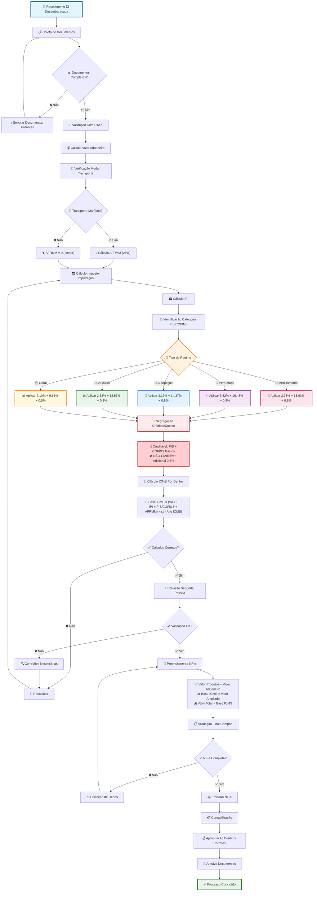
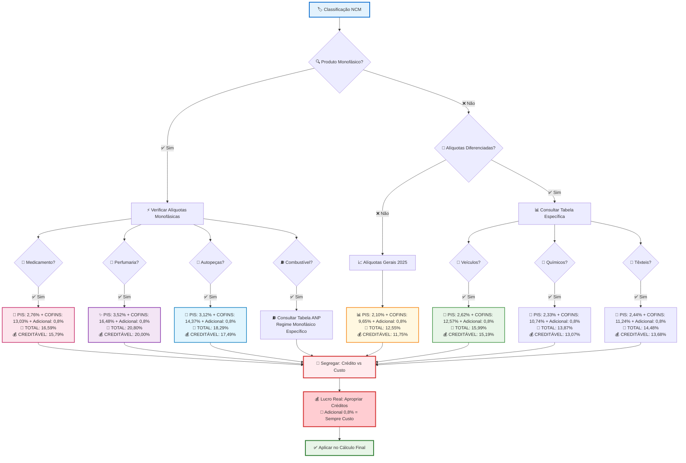
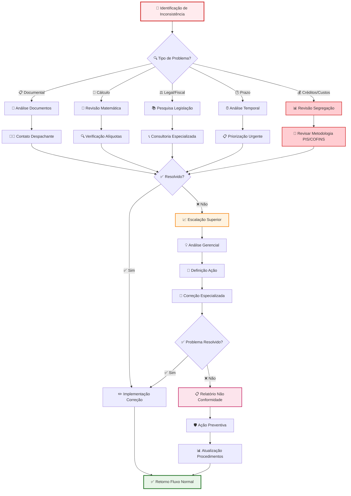
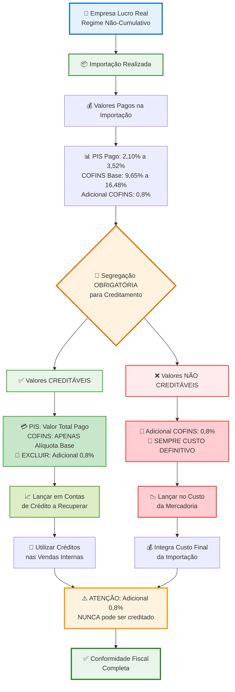
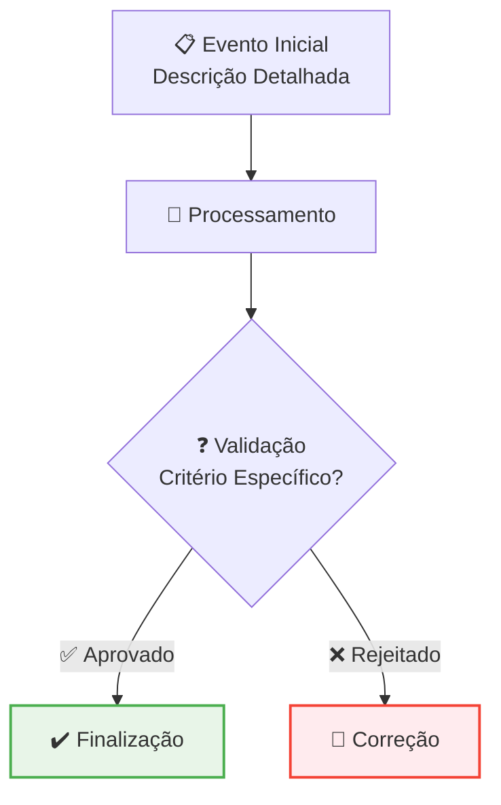

# PROCEDIMENTO OPERACIONAL PADRÃO

## APURAÇÃO DE IMPOSTOS DECORRENTES DE IMPORTAÇÃO E EMISSÃO DE NOTA FISCAL DE ENTRADA - VERSÃO 2.0

### SUMÁRIO

1. **OBJETIVO** ........................................................................... 3
2. **ALCANCE** ........................................................................... 3
3. **DEFINIÇÕES E CONCEITOS** .......................................................... 4
4. **BASE LEGAL** ........................................................................ 6
5. **ESTRUTURA TRIBUTÁRIA NA IMPORTAÇÃO** ............................................ 7
6. **METODOLOGIA DE APURAÇÃO DOS IMPOSTOS** ........................................ 13
7. **CONTROLES E VALIDAÇÕES** ......................................................... 20
8. **ASPECTOS OPERACIONAIS** .......................................................... 22
9. **FLUXOS OPERACIONAIS** ............................................................ 24
10. **ASPECTOS CONTÁBEIS E FISCAIS** ................................................. 29
11. **DOCUMENTAÇÃO E ANEXOS** ........................................................ 32
12. **PERGUNTAS FREQUENTES** ......................................................... 34

---

# 1. OBJETIVO

Estabelecer diretrizes técnicas detalhadas para apuração de impostos decorrentes de operações de importação e emissão de nota fiscal eletrônica de entrada, assegurando conformidade fiscal, contábil e tributária em todas as etapas do processo de nacionalização de mercadorias. O procedimento visa padronizar metodologias de cálculo, minimizar riscos fiscais, garantir aproveitamento adequado de créditos tributários e assegurar aplicação correta da legislação tributária federal e estadual aplicável às operações de importação, considerando as particularidades específicas de cada categoria de produto, regime tributário aplicável e as diferenças fundamentais entre valor do produto, base de cálculo do ICMS e valor total da nota fiscal na importação.

# 2. ALCANCE

Este POP aplica-se integralmente a todas as operações de importação realizadas pela empresa, abrangendo desde o registro da Declaração de Importação (DI) até a emissão da nota fiscal de entrada correspondente e respectiva contabilização. O escopo contempla a apuração dos impostos federais (II, IPI, PIS/COFINS com suas alíquotas diferenciadas, AFRMM) e estaduais (ICMS), incluindo regimes especiais (Drawback, REPETRO, Zona Franca), produtos monofásicos, alíquotas diferenciadas por categoria, bem como controles contábeis e fiscais necessários para adequada nacionalização das mercadorias importadas e aproveitamento correto de créditos tributários no regime não-cumulativo, com atenção especial à segregação entre valores creditáveis e custos definitivos.

# 3. DEFINIÇÕES E CONCEITOS

## 3.1 Definições Operacionais

**Declaração de Importação (DI):** Documento eletrônico que formaliza o despacho aduaneiro de importação no Sistema Integrado de Comércio Exterior (Siscomex), contendo informações detalhadas sobre a mercadoria, valor aduaneiro, impostos devidos, classificação fiscal e demais dados necessários para liberação alfandegária e controle aduaneiro.

**Valor Aduaneiro:** Base de cálculo fundamental para todos os impostos incidentes na importação, composto pelo valor FOB da mercadoria, acrescido do frete internacional, seguro internacional e despesas aduaneiras. Constitui-se na referência obrigatória para determinação da carga tributária total da operação de importação.

**Taxa PTAX:** Taxa de câmbio oficial estabelecida pelo Banco Central do Brasil, correspondente à cotação PTAX de compra do dia útil anterior ao registro da DI, utilizada obrigatoriamente para conversão de moedas estrangeiras em reais nas operações de importação, sem possibilidade de ajustes posteriores por variação cambial.

**Nota Fiscal de Importação:** Documento fiscal eletrônico obrigatório que deve ser emitido após o desembaraço aduaneiro, registrando formalmente a entrada da mercadoria no estabelecimento importador e detalhando todos os impostos incidentes na operação, servindo como base para escrituração fiscal e contábil.

**Diferencial Estrutural da NF-e de Importação:** **Particularidade fundamental** que distingue a importação do mercado interno, onde três campos principais da NF-e apresentam valores obrigatoriamente distintos:

- **Valor dos Produtos:** Apenas o valor aduaneiro (FOB + frete + seguro + despesas)  
- **Base de Cálculo ICMS:** Valor ampliado calculado "por dentro" incluindo todos os impostos
- **Valor Total da NF-e:** Igual à Base de Cálculo ICMS na importação

## 3.2 Conceitos Tributários Fundamentais

### 3.2.1 Impostos Federais na Importação

**Imposto de Importação (II):** Tributo federal incidente sobre mercadorias estrangeiras, com alíquotas específicas estabelecidas na Tarifa Externa Comum do Mercosul (TEC), baseadas na classificação NCM dos produtos. Sempre integra o custo da mercadoria importada, não sendo passível de creditamento ou recuperação.

**IPI na Importação:** Imposto sobre Produtos Industrializados aplicado com as mesmas alíquotas previstas na TIPI para produtos nacionais similares, incidindo sobre a base de cálculo formada pelo valor aduaneiro acrescido do Imposto de Importação, garantindo isonomia tributária entre produtos nacionais e importados.

**PIS/COFINS na Importação:** Contribuições sociais regidas pela Lei 10.865/2004, com alíquotas específicas estabelecidas para importação que **diferem substancialmente** do regime não-cumulativo aplicado no mercado interno. As alíquotas gerais são: **2,10% (PIS) e 9,65% (COFINS), totalizando 11,75%** sobre o valor aduaneiro. Adicionalmente, incide **adicional de COFINS-Importação de 0,8% em 2025**, conforme Lei 14.973/2024, resultando em carga tributária total de **12,55%** para produtos em geral.

**AFRMM - Adicional ao Frete para Renovação da Marinha Mercante:** Contribuição que incide sobre o frete internacional marítimo à alíquota de **25%**, destinada ao financiamento da renovação e ampliação da frota mercante nacional. **Transporte aéreo é isento desde 2015**. Base de cálculo é o mesmo valor do frete utilizado no valor aduaneiro.

### 3.2.2 Regimes Especiais e Categorias Diferenciadas

**Regime Monofásico:** Sistemática que concentra a tributação de PIS/COFINS em uma única etapa da cadeia produtiva, normalmente no fabricante ou importador, com alíquotas majoradas específicas, permitindo revenda posterior com alíquota zero.

**Alíquotas Diferenciadas:** Categorias específicas de produtos (medicamentos, perfumaria, autopeças, veículos) que possuem alíquotas próprias de PIS/COFINS na importação, significativamente superiores às alíquotas gerais, estabelecidas pela Lei 10.865/2004.

**ICMS "Por Dentro":** Metodologia específica de cálculo do ICMS na importação onde o próprio ICMS integra sua base de cálculo, exigindo aplicação de fórmula matemática diferenciada: Base ICMS = (Valor Aduaneiro + II + IPI + PIS/COFINS + AFRMM + Outras Despesas) ÷ (1 - Alíquota ICMS).

## 3.3 Regimes Especiais Aplicáveis

### 3.3.1 Drawback

Regime aduaneiro especial que permite suspensão ou eliminação de impostos na importação de insumos destinados à fabricação de produtos para exportação, condicionado ao cumprimento de compromisso de exportação em prazo determinado.

### 3.3.2 REPETRO

Regime Tributário para Exploração e Produção de Petróleo, que prevê tratamento diferenciado com isenção de impostos para importação de equipamentos destinados às atividades petrolíferas, mediante classificação específica em subposições NCM elegíveis.

### 3.3.3 Zona Franca de Manaus

Área de livre comércio com benefícios fiscais específicos para importação e industrialização de produtos na região amazônica, com redução ou isenção de impostos federais conforme projeto aprovado pela SUFRAMA.

# 4. BASE LEGAL

## 4.1 Legislação Federal

**Regulamento Aduaneiro (Decreto nº 6.759/2009):** Estabelece normas gerais de tributação, procedimentos aduaneiros e regras para determinação do valor aduaneiro, constituindo marco regulatório fundamental para operações de importação e base para aplicação de todos os tributos incidentes.

**Lei nº 3.244/1957 e Decreto-Lei nº 37/1966:** Disciplinam o Imposto de Importação, definindo hipóteses de incidência, base de cálculo, alíquotas da TEC e sistemática de cobrança, incluindo regras para aplicação de medidas antidumping e direitos compensatórios.

**Lei nº 4.502/1964 e Decreto nº 7.212/2010 (RIPI):** Regulamentam a incidência do IPI na importação, estabelecendo alíquotas conforme TIPI, procedimentos específicos para cálculo e isonomia tributária com produtos nacionais.

**Lei nº 10.865/2004:** Institui PIS/COFINS na importação com alíquotas específicas e diferenciadas por categoria de produto, estabelecendo base de cálculo, sistemática de recolhimento e regras para aproveitamento de créditos por empresas do regime não-cumulativo.

**Lei nº 14.973/2024:** Estabelece cronograma de redução gradual do adicional de COFINS-Importação, com extinção completa em 2028, impactando significativamente a carga tributária das importações.

**Lei nº 10.893/2004:** Dispõe sobre o Adicional ao Frete para Renovação da Marinha Mercante - AFRMM, estabelecendo alíquotas e sistemática de cobrança para financiamento da marinha mercante nacional.

**Lei nº 10.336/2001:** Regulamenta regime monofásico para combustíveis e define sistemática específica de tributação com concentração em uma única etapa da cadeia.

## 4.2 Legislação Estadual

**Lei Complementar nº 87/1996 (Lei Kandir):** Estabelece normas gerais do ICMS, incluindo disposições específicas para importação, metodologia de cálculo "por dentro" e regras para aproveitamento de créditos tributários.

**RICMS Estaduais:** Regulamentos de cada unidade federativa que estabelecem procedimentos específicos para ICMS na importação, incluindo alíquotas internas, códigos de situação tributária (CST), obrigações acessórias e regimes de substituição tributária.

**Convênios ICMS:** Acordos interestaduais que harmonizam tratamento tributário para operações de importação, evitam bitributação e definem regras uniformes para aplicação do imposto estadual.

## 4.3 Normas e Regulamentações Específicas

**Instruções Normativas da RFB:** Detalham procedimentos operacionais específicos, atualizações de nomenclaturas NCM, esclarecimentos sobre aplicação da legislação tributária e orientações para regimes especiais.

**Portarias do MDIC:** Estabelecem alíquotas atualizadas de Imposto de Importação, medidas de defesa comercial (antidumping, salvaguardas) e procedimentos para licenciamento de importações de produtos sensíveis.

**Atos COTEPE/ICMS:** Normatizam procedimentos operacionais específicos para ICMS em operações de importação, incluindo códigos de situação tributária, regras de substituição tributária e protocolos interestaduais.

# 5. ESTRUTURA TRIBUTÁRIA NA IMPORTAÇÃO

## 5.1 Hierarquia de Incidência Tributária

### 5.1.1 Sequência Obrigatória de Cálculo

A tributação na importação segue sequência específica e hierárquica que determina a base de cálculo de cada imposto subsequente. Esta hierarquia é estabelecida pela legislação federal e deve ser rigorosamente observada para correção dos cálculos tributários:

**Primeira Base - Valor Aduaneiro:**
Valor Aduaneiro = Valor FOB + Frete Internacional + Seguro Internacional + Despesas Aduaneiras

**Segunda Base - Imposto de Importação:**
Base II = Valor Aduaneiro
II = Valor Aduaneiro × Alíquota NCM (%)

**Terceira Base - IPI:**
Base IPI = Valor Aduaneiro + Imposto de Importação
IPI = (Valor Aduaneiro + II) × Alíquota TIPI (%)

**Quarta Base - PIS/COFINS:**
Base PIS/COFINS = Valor Aduaneiro (mesma base do II)
PIS = Valor Aduaneiro × Alíquota PIS específica
COFINS = Valor Aduaneiro × (Alíquota COFINS + Adicional)

**Quinta Base - AFRMM (quando aplicável):**
Base AFRMM = Frete Internacional Marítimo
AFRMM = Frete Internacional × 25%

**Sexta Base - ICMS "Por Dentro":**
Base ICMS = (Valor Aduaneiro + II + IPI + PIS/COFINS + AFRMM + Outras Despesas) ÷ (1 - Alíquota ICMS)
ICMS = Base ICMS × Alíquota ICMS (%)

## 5.2 PIS/COFINS na Importação - Estrutura Atualizada

### 5.2.1 Alíquotas Gerais

**PIS-Importação:** 2,10% sobre o valor aduaneiro
**COFINS-Importação:** 9,65% sobre o valor aduaneiro  
**Adicional COFINS-Importação 2025:** 0,8% adicional
**Total Geral:** 12,55% sobre o valor aduaneiro

### 5.2.2 Cronograma de Redução do Adicional COFINS

| Ano      | Adicional | COFINS Total | PIS + COFINS Total |
| -------- | --------- | ------------ | ------------------ |
| **2025** | 0,8%      | 10,45%       | **12,55%**         |
| **2026** | 0,6%      | 10,25%       | **12,35%**         |
| **2027** | 0,4%      | 10,05%       | **12,15%**         |
| **2028** | 0,0%      | 9,65%        | **11,75%**         |

### 5.2.3 Produtos com Alíquotas Diferenciadas

| **Categoria de Produto** | **PIS** | **COFINS Base** | **Adicional** | **TOTAL 2025** | **NCMs Típicos** |
| ------------------------ | ------- | --------------- | ------------- | -------------- | ---------------- |
| **Produtos Gerais**      | 2,10%   | 9,65%           | 0,8%          | **12,55%**     | Maioria dos NCMs |
| **Medicamentos**         | 2,76%   | 13,03%          | 0,8%          | **16,59%**     | 30.01 a 30.06    |
| **Perfumaria/Higiene**   | 3,52%   | 16,48%          | 0,8%          | **20,80%**     | 33.03 a 33.07    |
| **Autopeças**            | 3,12%   | 14,37%          | 0,8%          | **18,29%**     | Capítulo 87      |
| **Veículos**             | 2,62%   | 12,57%          | 0,8%          | **15,99%**     | 87.01 a 87.05    |
| **Produtos Químicos**    | 2,33%   | 10,74%          | 0,8%          | **13,87%**     | Capítulos 28-38  |
| **Produtos Têxteis**     | 2,44%   | 11,24%          | 0,8%          | **14,48%**     | Capítulos 50-63  |

## 5.3 Regime Monofásico de PIS/COFINS

### 5.3.1 Características Fundamentais

**Concentração Tributária:** Fabricantes/importadores pagam alíquotas majoradas específicas
**Revenda com Alíquota Zero:** Distribuidores e revendedores aplicam alíquota 0% nas operações subsequentes
**Controle Rigoroso:** Exige controle específico da destinação das mercadorias e cadeia de distribuição
**Base Legal:** Lei 10.336/2001, Lei 10.865/2004 e regulamentação específica por categoria

### 5.3.2 Produtos Abrangidos pelo Regime Monofásico

**Combustíveis e Derivados:**

- Gasolina, álcool etílico, diesel e demais derivados de petróleo
- GLP (gás liquefeito de petróleo) e gás natural

**Produtos Tabagistas:**

- Cigarros, charutos, cigarrilhas e demais produtos do tabaco
- Papel para cigarros e filtros

**Bebidas:**

- Cervejas, chopes, vinhos e fermentados
- Aguardentes, licores e demais bebidas destiladas

**Medicamentos e Perfumaria:**

- Produtos farmacêuticos e veterinários
- Cosméticos, perfumes e artigos de higiene pessoal e beleza

**Autopeças e Pneus:**

- Peças, partes e acessórios para veículos automotores
- Pneus, câmaras de ar e protetores de borracha

## 5.4 AFRMM - Adicional ao Frete para Renovação da Marinha Mercante

### 5.4.1 Características Gerais

**Base Legal:** Lei nº 10.893/2004 e Decreto nº 6.759/2009
**Finalidade:** Financiar renovação e ampliação da frota mercante nacional
**Natureza:** Contribuição de intervenção no domínio econômico

### 5.4.2 Incidência e Alíquotas

**Base de Cálculo:** Frete internacional (mesmo utilizado no valor aduaneiro)
**Alíquotas Vigentes 2025:**

- **Transporte aquaviário:** 25% sobre o frete internacional
- **Transporte aéreo:** 0% (isento desde 2015)

**Fórmula de Cálculo:**
AFRMM = Frete Internacional Marítimo × 25%

### 5.4.3 Integração no Custo e Bases Tributárias

- **Compõe despesas aduaneiras** para fins de valor aduaneiro
- **Integra base de cálculo do ICMS** quando devido
- **Não há recuperação** ou creditamento possível
- **Sempre custo definitivo** da operação de importação

### 5.4.4 Isenções Principais

- Mercadorias destinadas à Zona Franca de Manaus
- Produtos importados ao amparo do REPETRO
- Bens importados para feira, exposição ou evento similar
- Bagagem de passageiros e remessa postal internacional

## 5.5 Aproveitamento de Créditos no Lucro Real

### 5.5.1 Princípio Fundamental Corrigido

Empresas tributadas pelo Lucro Real no regime não-cumulativo podem apropriar créditos de PIS/COFINS sobre importações, mas **ATENÇÃO CRÍTICA:** apenas as alíquotas básicas efetivamente pagas na importação são creditáveis. **O adicional de COFINS-Importação (0,8% em 2025) NÃO é creditável**, constituindo sempre custo da mercadoria.

### 5.5.2 Metodologia Correta de Apropriação

**❌ MÉTODO INCORRETO:** 
Creditar sempre 1,65% (PIS) + 7,60% (COFINS) = 9,25%

**❌ MÉTODO INCORRETO:** 
Creditar o total pago incluindo o adicional de COFINS

**✅ MÉTODO CORRETO:**
Creditar apenas as alíquotas básicas efetivamente pagas, EXCLUINDO o adicional de COFINS

**Exemplos de Cálculo Correto:**

**Produto Geral (2025):**

- PIS pago na importação: 2,10% (creditável)
- COFINS básico pago: 9,65% (creditável)
- Adicional COFINS pago: 0,8% (**NÃO creditável - sempre custo**)
- **Crédito apropriável:** 2,10% + 9,65% = **11,75%**
- **Custo adicional:** 0,8% sobre valor aduaneiro

**Medicamento (2025):**

- PIS pago na importação: 2,76% (creditável)
- COFINS básico pago: 13,03% (creditável)
- Adicional COFINS pago: 0,8% (**NÃO creditável - sempre custo**)
- **Crédito apropriável:** 2,76% + 13,03% = **15,79%**
- **Custo adicional:** 0,8% sobre valor aduaneiro

### 5.5.3 Impacto Financeiro da Correção

**Produto Geral - Crédito Correto:**

- Total pago: 12,55% (2,10% + 9,65% + 0,8%)
- Crédito apropriável: 11,75% (2,10% + 9,65%)
- Custo líquido adicional: 0,8% sobre valor aduaneiro

**Medicamentos - Crédito Correto:**

- Total pago: 16,59% (2,76% + 13,03% + 0,8%)
- Crédito apropriável: 15,79% (2,76% + 13,03%)
- Custo líquido adicional: 0,8% sobre valor aduaneiro

**ERRO COMUM IDENTIFICADO:** Incluir o adicional de 0,8% nos créditos apropriáveis, o que constitui erro fiscal que pode resultar em autuação por apropriação indevida de créditos.

# 6. METODOLOGIA DE APURAÇÃO DOS IMPOSTOS

## 6.1 Procedimentos Preparatórios

### 6.1.1 Coleta e Validação de Documentos Base

**Documentos Obrigatórios:**

- Declaração de Importação (DI) registrada e desembaraçada no Siscomex
- Fatura comercial (Commercial Invoice) original em moeda estrangeira
- Conhecimento de transporte internacional (Bill of Lading/Air Waybill)
- Comprovante de pagamento do frete internacional
- Apólice de seguro internacional ou comprovante de pagamento de prêmio
- Demonstrativo detalhado de despesas aduaneiras
- Comprovante de recolhimento de AFRMM (quando aplicável)

**Validações Críticas Preliminares:**

- Conferência rigorosa da taxa PTAX utilizada na DI (PTAX de compra do dia anterior ao registro)
- Verificação de consistência entre valores da DI e documentos comerciais originais
- Confirmação da classificação NCM e verificação de alíquotas vigentes
- Validação da completude e autenticidade dos documentos fiscais
- Identificação do modal de transporte para AFRMM

### 6.1.2 Determinação Precisa do Valor Aduaneiro

O valor aduaneiro deve ser apurado rigorosamente conforme metodologia estabelecida no Regulamento Aduaneiro, observando-se os seguintes componentes obrigatórios:

**Componentes do Valor Aduaneiro:**

**Valor FOB Convertido:** 
Valor FOB em USD × Taxa PTAX da DI = Valor FOB em BRL

**Frete Internacional Convertido:**
Frete Internacional em USD × Taxa PTAX da DI = Frete em BRL

**Seguro Internacional Convertido:**
Seguro Internacional em USD × Taxa PTAX da DI = Seguro em BRL

**Despesas Aduaneiras em Reais:**
Somatório de todas as despesas portuárias, armazenagem, taxa Siscomex, AFRMM e demais custos até o desembaraço

**Fórmula Final:**
**Valor Aduaneiro Total = FOB Convertido + Frete Convertido + Seguro Convertido + Despesas Aduaneiras**

## 6.2 Sequência Detalhada de Cálculo dos Impostos

### 6.2.1 Cálculo do Imposto de Importação (II)

**Passo 1:** Identificar alíquota NCM na Tarifa Externa Comum (TEC)
**Passo 2:** Verificar existência de medidas antidumping ou direitos compensatórios
**Passo 3:** Aplicar fórmula: II = Valor Aduaneiro × Alíquota NCM (%)
**Passo 4:** Registrar valor calculado para utilização nas bases de cálculo subsequentes

**Exemplo Prático Detalhado:**

- Produto: Equipamentos eletrônicos - NCM 8517.62.55
- Valor Aduaneiro: R$ 66.560,00
- Alíquota TEC NCM 8517.62.55: 10%
- **II = R$ 66.560,00 × 10% = R\$ 6.656,00***

### 6.2.2 Cálculo do IPI na Importação

**Passo 1:** Determinar base de cálculo: Valor Aduaneiro + II
**Passo 2:** Identificar alíquota TIPI correspondente ao NCM específico
**Passo 3:** Aplicar fórmula: IPI = (Valor Aduaneiro + II) × Alíquota TIPI (%)
**Passo 4:** Documentar alíquota utilizada e base de cálculo

### 6.2.3 Cálculo Correto do PIS/COFINS na Importação

**Passo 1:** Identificar categoria do produto e regime aplicável

- Verificar se o produto está sujeito a alíquotas diferenciadas
- Consultar NCM na tabela oficial de produtos especiais
- Confirmar adicional de COFINS vigente no ano da importação

**Passo 2:** Determinar alíquotas específicas aplicáveis

- PIS conforme categoria do produto
- COFINS base conforme categoria do produto
- Adicional COFINS conforme cronograma de redução

**Passo 3:** Aplicar cálculo sobre valor aduaneiro

- PIS = Valor Aduaneiro × Alíquota PIS específica
- COFINS = Valor Aduaneiro × (Alíquota COFINS + Adicional)

**Passo 4:** Segregar valores para aproveitamento de créditos

- **Creditável (Lucro Real):** PIS + COFINS básico
- **NÃO Creditável:** Adicional de COFINS (sempre custo)

### 6.2.4 Cálculo do AFRMM (quando aplicável)

**Passo 1:** Verificar modal de transporte

- Transporte marítimo: Alíquota 25%
- Transporte aéreo: Isento (0%)

**Passo 2:** Aplicar fórmula (apenas transporte marítimo)
AFRMM = Frete Internacional × 25%

**Passo 3:** Incluir nas despesas aduaneiras para base do ICMS

### 6.2.5 Cálculo do ICMS "Por Dentro"

**Passo 1:** Somar todos os impostos federais e outras despesas
**Passo 2:** Aplicar fórmula específica para cálculo "por dentro"
**Passo 3:** Calcular ICMS sobre base ampliada que inclui o próprio ICMS

**Fórmula Completa:**
Base ICMS = (Valor Aduaneiro + II + IPI + PIS/COFINS + AFRMM + Outras Despesas) ÷ (1 - Alíquota ICMS)
ICMS = Base ICMS × Alíquota ICMS

### 6.2.6 Estruturação dos Campos da NF-e de Importação

**ATENÇÃO CRÍTICA:** Na importação, os três campos principais da NF-e têm valores obrigatoriamente distintos:

**Valor dos Produtos (Campo NF-e):**

- Valor Aduaneiro
- Representa apenas: FOB + Frete + Seguro + Despesas Aduaneiras

**Base de Cálculo ICMS (Campo NF-e):**

- Valor ampliado calculado "por dentro"
- Inclui: Valor Aduaneiro + Todos os Impostos + Próprio ICMS

**Valor Total da NF-e (Campo NF-e):**

- Igual à Base de Cálculo ICMS
- Diferença para Valor dos Produtos: todos os impostos

## 6.3 Exemplo Prático Completo

### 6.3.1 Situação-Exemplo

**Dados da Operação:**

- Valor FOB: R$ 50.000,00
- Frete Internacional (marítimo): R$ 8.000,00
- Seguro: R$ 2.560,00
- AFRMM (25% × R$ 8.000): R\$ 2.000,00
- Taxa SISCOMEX: R$ 185,00
- Outras despesas: R$ 3.815,00
- **Valor Aduaneiro:** R$ 66.560,00

**Aplicação do Procedimento:**

1. Classificação NCM: Produto geral (não monofásico, sem alíquotas diferenciadas)
2. Alíquotas aplicáveis: PIS 2,10% + COFINS 9,65% + Adicional 0,8% = 12,55%
3. Cálculo sequencial: II → IPI → PIS/COFINS → ICMS

### 6.3.2 Cálculos Detalhados

**II (10%):** R$ 66.560,00 × 10% = R\$ 6.656,00
**IPI (15%):** (R$ 66.560,00 + R\$ 6.656,00) × 15% = R$ 10.982,40
**PIS (2,1%):** R\$ 66.560,00 × 2,10% = R$ 1.397,76 (creditável)
**COFINS base (9,65%):** R\$ 66.560,00 × 9,65% = R$ 6.424,96 (creditável)
**Adicional COFINS (0,8%):** R\$ 66.560,00 × 0,8% = R$ 532,48 (**sempre custo**)
**ICMS (18% "por dentro"):**

- Soma antes ICMS: R$ 92.551,68
- Base ICMS: R$ 92.551,68 ÷ 0,82 = R\$ 112.867,66
- ICMS: R$ 112.867,66 × 18% = R\$ 20.316,38

### 6.3.3 Estruturação da NF-e

| **Campo NF-e**           | **Valor**     | **Composição**         |
| ------------------------ | ------------- | ---------------------- |
| **Valor dos Produtos**   | R$ 66.560,00  | Apenas valor aduaneiro |
| **Base de Cálculo ICMS** | R$ 112.867,66 | Cálculo "por dentro"   |
| **Valor Total NF-e**     | R$ 112.867,66 | Igual à Base ICMS      |

### 6.3.4 Aproveitamento de Créditos (Lucro Real)

**Créditos Apropriáveis:**

- PIS: R$ 1.397,76
- COFINS: R$ 6.424,96
- ICMS: R$ 20.316,38
- **Total creditável:** R$ 28.139,10

**Custos Definitivos:**

- II: R$ 6.656,00
- IPI: R$ 10.982,40 (se não industrial)
- Adicional COFINS: R$ 532,48
- **Custo líquido adicional:** R$ 532,48 (após créditos)

---

**EXEMPLO PRÁTICO CONSOLIDADO:**

**Situação-Exemplo:** Importação de equipamento eletrônico via transporte marítimo, destinado à comercialização por empresa do Lucro Real

**Dados da Operação:**

- Valor FOB: R$ 50.000,00
- Frete Internacional (marítimo): R$ 8.000,00
- Seguro: R$ 2.560,00
- AFRMM (25% × R$ 8.000): R\$ 2.000,00
- Taxa SISCOMEX: R$ 185,00
- Outras despesas: R$ 3.815,00
- **Valor Aduaneiro:** R$ 66.560,00

**Aplicação Completa do Procedimento:**

1. Classificação NCM: Produto geral (não monofásico, sem alíquotas diferenciadas)
2. Modal de transporte: Marítimo (sujeito a AFRMM)
3. Alíquotas aplicáveis: PIS 2,10% + COFINS 9,65% + Adicional 0,8% = 12,55%
4. Empresa: Lucro Real (direito a créditos, exceto adicional COFINS)

**Cálculos Detalhados:**

- **II (10%):** R$ 66.560,00 × 10% = **R\$ 6.656,00**
- **IPI (15%):** R$ 73.216,00 × 15% = **R\$ 10.982,40**
- **PIS (2,1%):** R$ 66.560,00 × 2,10% = **R\$ 1.397,76** (creditável)
- **COFINS base (9,65%):** R$ 66.560,00 × 9,65% = **R\$ 6.424,96** (creditável)
- **Adicional COFINS (0,8%):** R$ 66.560,00 × 0,8% = **R\$ 532,48** (sempre custo)
- **ICMS (18% "por dentro"):** Base R$ 112.867,66 × 18% = **R\$ 20.316,38**

**Estruturação Correta da NF-e:**

- **Valor dos Produtos:** R$ 66.560,00
- **Base de Cálculo ICMS:** R$ 112.867,66
- **Valor Total da NF-e:** R$ 112.867,66
- **Diferença (todos os impostos):** R$ 46.307,66

**Tratamento Contábil (Lucro Real):**

- **Créditos Apropriáveis:** R$ 28.139,10 (PIS + COFINS básico + ICMS)
- **Custos Definitivos:** R$ 18.171,88 (II + IPI + Adicional COFINS)
- **Custo Líquido da Mercadoria:** R$ 56.732,46

# 7. CONTROLES E VALIDAÇÕES

## 7.1 Controles Documentais

### 7.1.1 Documentos Obrigatórios

**Declaração de Importação (DI):** Documento principal contendo todos os dados fiscais e aduaneiros, incluindo valor aduaneiro, impostos calculados, classificação NCM e dados do importador e exportador.

**Fatura Comercial (Commercial Invoice):** Documento original emitido pelo exportador contendo descrição detalhada das mercadorias, valores FOB, condições de pagamento e dados das partes envolvidas.

**Conhecimento de Transporte:** Documento comprobatório do frete internacional (Bill of Lading para transporte marítimo, Air Waybill para transporte aéreo), contendo valor do frete e condições de transporte.

**Comprovante de Seguro:** Apólice de seguro internacional ou comprovante de pagamento do prêmio, demonstrando cobertura da mercadoria durante o transporte internacional.

**Demonstrativo de Despesas:** Detalhamento de todas as despesas aduaneiras incorridas até o desembaraço, incluindo taxas portuárias, armazenagem, AFRMM, taxa Siscomex e honorários de despachante.

### 7.1.2 Validações Documentais Obrigatórias

**Conferência de Dados Essenciais:**

- Consistência entre valores da DI e documentos comerciais
- Exatidão da taxa PTAX utilizada (PTAX de compra do dia anterior ao registro da DI)
- Correção da classificação NCM e verificação de alterações recentes
- Completude de todas as informações obrigatórias

**Verificação de Autenticidade:**

- Validação de assinatura digital da DI no Siscomex
- Conferência de numeração sequencial e integridade dos documentos
- Verificação de carimbos e autenticações necessárias

**Controle de Completude:**

- Checklist de todos os documentos obrigatórios
- Verificação de preenchimento de campos essenciais
- Conferência de anexos técnicos quando necessários

**Controle de Vencimentos:**

- Verificação de prazos de validade dos documentos
- Controle de vencimento de licenças de importação
- Acompanhamento de prazos para correções ou complementações

## 7.2 Controles Operacionais

### 7.2.1 Checklist de Validação Tributária

**Cálculos Tributários:**

- ✅ Valor aduaneiro calculado corretamente (FOB + Frete + Seguro + Despesas)
- ✅ Taxa PTAX idêntica em toda a operação
- ✅ Sequência hierárquica de cálculo dos impostos respeitada
- ✅ Alíquotas atualizadas e corretas por NCM
- ✅ ICMS calculado pela metodologia "por dentro"
- ✅ PIS/COFINS com alíquotas específicas por categoria de produto
- ✅ Adicional de COFINS incluído conforme cronograma vigente
- ✅ AFRMM calculado apenas para transporte marítimo
- ✅ Segregação correta entre créditos e custos para Lucro Real

**Classificação e Códigos:**

- ✅ NCM correto e atualizado
- ✅ CFOP adequado à natureza da operação (3102/3101/3551)
- ✅ CST correto para cada imposto (ICMS, IPI, PIS/COFINS)
- ✅ Códigos de situação tributária consistentes

**Documentação Fiscal:**

- ✅ Campos obrigatórios da NF-e preenchidos corretamente
- ✅ Informações de importação completas (DI, data, local, adição)
- ✅ Dados do exportador conforme padrão para exterior
- ✅ Observações fiscais obrigatórias incluídas
- ✅ Diferenciação correta entre Valor dos Produtos, Base ICMS e Valor Total

### 7.2.2 Controles de Qualidade

**Revisão por Segunda Pessoa:**
Todo cálculo tributário deve ser obrigatoriamente revisado por pessoa diferente do executor, incluindo:

- Conferência matemática de todas as fórmulas aplicadas
- Validação da aplicação correta das alíquotas específicas
- Verificação da consistência entre DI e cálculos internos
- Aprovação final antes da emissão da NF-e

**Documentação de Evidências:**
Manter arquivo organizado contendo:

- Memória de cálculo detalhada de todos os impostos
- Justificativa da classificação NCM utilizada
- Documentação da taxa PTAX e data de aplicação
- Evidências da categoria do produto para PIS/COFINS diferenciado
- Segregação documentada entre créditos apropriáveis e custos

**Arquivo Sistemático:**

- Organização cronológica por DI
- Indexação por fornecedor e produto
- Controle de versões e alterações
- Backup eletrônico de todos os documentos críticos

**Backup e Recuperação:**

- Backup diário dos cálculos e documentos
- Armazenamento em nuvem segura
- Procedimentos de recuperação testados
- Retenção por prazo legal de 5 anos

# 8. ASPECTOS OPERACIONAIS

## 8.1 Responsabilidades

### 8.1.1 Responsabilidades por Função

**Analista Fiscal Sênior:**

- Cálculo e validação de todos os impostos de importação
- Aplicação correta das alíquotas específicas de PIS/COFINS por categoria
- Identificação correta dos regimes tributários aplicáveis
- Preenchimento completo da nota fiscal de entrada
- Documentação e arquivo de evidências fiscais
- Primeira revisão dos cálculos tributários
- Segregação adequada entre créditos apropriáveis e custos

**Supervisor Fiscal:**

- Revisão obrigatória por segunda pessoa de todos os cálculos
- Aprovação final da nota fiscal antes da emissão
- Resolução de inconsistências e tratamento de exceções
- Interface com despachantes aduaneiros e órgãos fiscalizadores
- Atualização de procedimentos conforme alterações legislativas
- Validação da metodologia de aproveitamento de créditos

**Contador Responsável:**

- Contabilização adequada dos custos de importação
- Apropriação correta dos créditos de PIS/COFINS (excluindo adicional)
- Conciliação entre valores fiscais e contábeis
- Preparação de demonstrativos para auditoria
- Cumprimento de obrigações acessórias relacionadas
- Controle da segregação entre valores creditáveis e custos definitivos

**Analista de Comércio Exterior:**

- Coleta e organização de documentos de importação
- Interface com despachantes e fornecedores estrangeiros
- Controle de prazos e acompanhamento de desembaraços
- Verificação preliminar de consistência documental
- Suporte técnico em classificação NCM
- Controle de recolhimento de AFRMM

### 8.1.2 Matriz RACI de Responsabilidades

| **Atividade**              | **Analista Fiscal** | **Supervisor** | **Contador** | **Comex** |
| -------------------------- | ------------------- | -------------- | ------------ | --------- |
| Coleta de Documentos       | C                   | I              | I            | **R**     |
| Cálculo de Impostos        | **R**               | **A**          | C            | I         |
| Revisão de Cálculos        | I                   | **R**          | C            | I         |
| Emissão de NF-e            | **R**               | **A**          | I            | I         |
| Contabilização             | C                   | I              | **R**        | I         |
| Apropriação de Créditos    | C                   | I              | **R**        | I         |
| Segregação Créditos/Custos | **R**               | **A**          | **R**        | I         |
| Arquivo de Documentos      | **R**               | **A**          | C            | C         |
| Tratamento de Exceções     | I                   | **R**          | C            | C         |

**R=Responsável, A=Aprovador, C=Consultado, I=Informado**

## 8.2 Prazos e Cronogramas

### 8.2.1 Prazos Regulamentares

**Emissão da NF-e de Entrada:** Até 24 horas após o desembaraço aduaneiro ou antes da entrada física da mercadoria no estabelecimento, o que ocorrer primeiro.

**Escrituração Fiscal:** Até o dia 15 do mês subsequente ao da importação, conforme regulamento estadual de ICMS.

**Apropriação de Créditos:** Até o último dia útil do mês seguinte ao da importação, para empresas do regime não-cumulativo de PIS/COFINS.

**Arquivo de Documentos:** Prazo de guarda de 5 anos contados da emissão da NF-e, conforme Código Tributário Nacional.

### 8.2.2 Cronograma Operacional Padrão

**Fase 1 - Preparação (D+0 a D+1):**

- Recebimento da DI desembaraçada
- Coleta e validação de documentos suporte
- Verificação da taxa PTAX e consistência documental
- Identificação da categoria do produto para PIS/COFINS

**Fase 2 - Cálculo e Validação (D+1 a D+2):**

- Apuração sequencial de todos os impostos
- Aplicação das fórmulas específicas por imposto
- Segregação entre créditos apropriáveis e custos definitivos
- Verificação matemática e consistência dos resultados
- Revisão obrigatória por segunda pessoa

**Fase 3 - Emissão e Contabilização (D+2 a D+3):**

- Preenchimento completo da NF-e de entrada
- Emissão e transmissão da nota fiscal eletrônica
- Lançamento contábil dos custos e créditos tributários
- Arquivo organizado de toda documentação

**Fase 4 - Controle e Arquivo (D+3 a D+5):**

- Verificação de aceite da NF-e pela Sefaz
- Organização final dos documentos físicos e eletrônicos
- Atualização de controles internos e dashboards
- Backup seguro de todos os arquivos críticos

## 8.3 Indicadores de Performance

### 8.3.1 Métricas de Qualidade

**Taxa de Erro em Cálculos:** Meta < 2% mensal
**Prazo Médio de Emissão:** Meta ≤ 24 horas após desembaraço
**Compliance Documental:** Meta 100% de documentos arquivados
**Revisão por Segunda Pessoa:** Meta 100% das operações
**Segregação Correta Créditos/Custos:** Meta 100% das operações Lucro Real

### 8.3.2 Métricas de Eficiência

**Tempo Médio por Importação:** Meta ≤ 4 horas de trabalho técnico
**Retrabalho por Correções:** Meta < 5% das operações
**Aproveitamento Correto de Créditos:** Meta 100% dos créditos elegíveis
**Atualização de Alíquotas:** Meta 100% de conformidade com legislação vigente
**Controle de AFRMM:** Meta 100% de identificação correta por modal

# 9. FLUXOS OPERACIONAIS

## 9.1 Fluxo Principal de Importação

### 9.1.1 Representação Gráfica Detalhada



### 9.1.2 Detalhamento de Pontos Críticos

**Ponto Crítico 1 - Verificação Modal de Transporte (Nó G):**
A identificação correta do modal de transporte é essencial para aplicação adequada do AFRMM. Transporte marítimo está sujeito à alíquota de 25%, enquanto transporte aéreo é isento desde 2015.

**Ponto Crítico 2 - Segregação Créditos/Custos (Nó T):**
**FUNDAMENTAL:** Segregar corretamente os valores de PIS/COFINS entre creditáveis (alíquotas básicas) e custos definitivos (adicional de 0,8%). Esta segregação impacta diretamente o resultado fiscal e contábil da empresa.

**Ponto Crítico 3 - Estruturação NF-e (Nó DD):**
**ESSENCIAL:** Na importação, os três campos principais da NF-e têm valores distintos obrigatoriamente. Erro nesta estruturação pode resultar em autuação fiscal severa por subtributação do ICMS.

## 9.2 Fluxo de Identificação de Regime Tributário

### 9.2.1 Árvore de Decisão para Alíquotas



## 9.3 Fluxo de Tratamento de Exceções

### 9.3.1 Processo de Identificação e Correção



### 9.3.2 Matriz de Triggers e Ações

| **Trigger** | **Situação**                  | **Ação Imediata**                            | **Responsável** | **Prazo** |
| ----------- | ----------------------------- | -------------------------------------------- | --------------- | --------- |
| **T1**      | Divergência DI vs Documentos  | Suspender processo + Investigar origem       | Analista Fiscal | 4 horas   |
| **T2**      | Erro classificação NCM        | Consultar especialista + Reclassificar       | Supervisor      | 8 horas   |
| **T3**      | Alíquota incorreta aplicada   | Corrigir cálculo + Documentar alteração      | Analista Fiscal | 2 horas   |
| **T4**      | AFRMM mal calculado           | Verificar modal + Recalcular                 | Analista Fiscal | 1 hora    |
| **T5**      | Segregação créditos incorreta | Revisar metodologia + Segregar adequadamente | Contador        | 3 horas   |
| **T6**      | NF-e com campos incorretos    | Analisar estrutura + Corrigir campos         | Analista Fiscal | 2 horas   |

## 9.4 Fluxo de Creditamento PIS/COFINS Correto

### 9.4.1 Representação do Processo de Segregação de Créditos



# 10. ASPECTOS CONTÁBEIS E FISCAIS

## 10.1 Tratamento Contábil da Importação

### 10.1.1 Registro do Ativo Importado

**Critério de Mensuração Inicial:**
O bem importado deve ser registrado pelo custo total de aquisição, incluindo todos os gastos necessários para colocá-lo em condições de uso ou venda, conforme CPC 16 (Estoques) e CPC 27 (Imobilizado).

**Composição do Custo de Aquisição:**

**Custo Direto da Mercadoria:**

- Valor FOB convertido pela taxa PTAX da DI
- Frete internacional convertido
- Seguro internacional convertido

**Custos Tributários Não Recuperáveis:**

- Imposto de Importação (sempre custo)
- IPI (quando não recuperável)
- ICMS (quando não recuperável - Simples Nacional ou operações isentas)
- **Adicional COFINS-Importação (SEMPRE custo - nunca creditável)**
- AFRMM (sempre custo)

**Custos Acessórios:**

- Taxa Siscomex
- Despesas portuárias e de armazenagem
- Honorários de despachante aduaneiro
- Demais despesas até colocação do bem no estabelecimento

### 10.1.2 Lançamento Contábil Padrão

**Para Empresa do Lucro Real (Impostos Recuperáveis):**

```
D - Estoque de Mercadorias                    R$ 73.216,00
    (Valor Aduaneiro + II + Outras Despesas + Adicional COFINS)

D - ICMS a Recuperar                          R$ 20.316,38
    (Crédito de ICMS)

D - PIS a Recuperar                           R$ 1.397,76
    (Crédito PIS pelas alíquotas reais pagas)

D - COFINS a Recuperar                        R$ 6.424,96
    (Crédito COFINS APENAS alíquota básica - SEM adicional)

C - Fornecedores Estrangeiros                 R$ 101.355,10
    (Total da operação)
```

**OBSERVAÇÃO CRÍTICA:** O adicional de COFINS de R$ 532,48 (0,8%) **integra o custo** da mercadoria, não gerando crédito apropriável.

**Para Empresa do Simples Nacional (Impostos Não Recuperáveis):**

```
D - Estoque de Mercadorias                    R$ 101.355,10
    (Custo integral incluindo todos os impostos)

C - Fornecedores Estrangeiros                 R$ 101.355,10
```

### 10.1.3 Controle de Créditos Tributários Correto

**Empresas do Regime Não-Cumulativo:**
Devem apropriar créditos de PIS/COFINS **EXCLUINDO OBRIGATORIAMENTE** o adicional de COFINS-Importação, que constitui sempre custo da mercadoria.

**Cálculo Correto dos Créditos:**

| **Produto**      | **PIS Creditável** | **COFINS Creditável** | **Adicional (Custo)** | **Crédito Total** |
| ---------------- | ------------------ | --------------------- | --------------------- | ----------------- |
| **Geral**        | 2,10%              | 9,65%                 | 0,8%                  | **11,75%**        |
| **Medicamentos** | 2,76%              | 13,03%                | 0,8%                  | **15,79%**        |
| **Perfumaria**   | 3,52%              | 16,48%                | 0,8%                  | **20,00%**        |
| **Autopeças**    | 3,12%              | 14,37%                | 0,8%                  | **17,49%**        |

**Lançamento Contábil da Segregação:**

```
D - PIS a Recuperar                           R$ 1.397,76
D - COFINS a Recuperar                        R$ 6.424,96
D - Estoque de Mercadorias                    R$ 532,48 (adicional)
C - Fornecedores PIS/COFINS                   R$ 8.355,20
```

## 10.2 Aspectos Fiscais Específicos

### 10.2.1 Obrigações Principais

**ICMS - Recolhimento:**

- **Prazo:** Até o dia 15 do mês subsequente (conforme estado)
- **Base Legal:** RICMS estadual específico
- **Cálculo:** Débitos - Créditos do período
- **Particularidade:** ICMS da importação pode gerar crédito significativo

**PIS/COFINS - Recolhimento:**

- **Prazo:** Até o dia 25 do mês subsequente
- **Base Legal:** Lei 10.833/2003 e Lei 10.865/2004
- **Cálculo:** Débitos das vendas - Créditos das aquisições/importações
- **Particularidade Crítica:** Créditos da importação EXCLUEM o adicional de COFINS

**IPI - Recolhimento:**

- **Prazo:** Até o dia 25 do mês subsequente
- **Base Legal:** Decreto 7.212/2010 (RIPI)
- **Aplicabilidade:** Apenas para empresas industriais ou equiparadas
- **Particularidade:** IPI da importação gera crédito para industrialização

### 10.2.2 Obrigações Acessórias

**EFD-Contribuições:**

- **Periodicidade:** Mensal
- **Prazo de Entrega:** Até o 10º dia útil do 2º mês subsequente
- **Conteúdo:** Detalhamento de todos os créditos de PIS/COFINS da importação
- **Particularidade:** Deve informar alíquotas específicas por produto e segregar adicional como custo

**EFD-ICMS/IPI:**

- **Periodicidade:** Mensal
- **Prazo de Entrega:** Até o dia 20 do mês subsequente
- **Conteúdo:** Movimentação de mercadorias e créditos de ICMS/IPI
- **Particularidade:** Registro C170 deve conter dados da DI e AFRMM quando aplicável

**DCTF (Declaração de Débitos e Créditos Tributários Federais):**

- **Periodicidade:** Mensal
- **Prazo de Entrega:** Até o 15º dia útil do 2º mês subsequente
- **Conteúdo:** Consolidação de débitos e créditos federais
- **Particularidade:** Separar PIS/COFINS por alíquota específica e segregar adicional

## 10.3 Controle de Custos e Margem

### 10.3.1 Apropriação de Custos por Centro

**Critério de Rateio:**
Para importações de múltiplos produtos, os custos comuns (frete, seguro, despesas aduaneiras, AFRMM) devem ser apropriados proporcionalmente:

- **Base de Rateio:** Valor FOB individual / Valor FOB total
- **Aplicação:** Sobre frete, seguro, despesas aduaneiras e AFRMM
- **Documentação:** Manter planilha de rateio por DI
- **Validação:** Somatório deve igualar valores totais da DI

### 10.3.2 Análise de Impacto Tributário

**Simulação de Cenários com Segregação Correta:**

**Cenário 1 - Produto Geral (Lucro Real):**

- Carga PIS/COFINS total: 12,55%
- Crédito apropriável: 11,75% (PIS 2,10% + COFINS 9,65%)
- Custo líquido adicional: 0,8% (adicional COFINS)

**Cenário 2 - Medicamento (Lucro Real):**

- Carga PIS/COFINS total: 16,59%
- Crédito apropriável: 15,79% (PIS 2,76% + COFINS 13,03%)
- Custo líquido adicional: 0,8% (adicional COFINS)

**Cenário 3 - Simples Nacional:**

- Carga PIS/COFINS: 12,55% a 20,80% (conforme produto)
- Crédito apropriável: 0%
- Impacto integral no custo do produto

### 10.3.3 Indicadores de Gestão Tributária

**Taxa de Aproveitamento Correto de Créditos:**
Meta: 100% dos créditos elegíveis apropriados com segregação adequada

**Controle de Segregação PIS/COFINS:**
Meta: 100% das importações com separação correta entre crédito e custo

**Conformidade com Alíquotas Específicas:**
Meta: 100% das importações com alíquotas corretas por categoria

**Controle de AFRMM por Modal:**
Meta: 100% de identificação e cálculo correto conforme modal de transporte

**Economia Tributária por Correção de Metodologia:**
Medição: Diferença entre método incorreto e correto de apropriação de créditos

# 11. DOCUMENTAÇÃO E ANEXOS

## 11.1 Modelos e Formulários

### 11.1.1 Planilha de Cálculo de Impostos de Importação

Modelo padronizado contendo:

- Campos para todos os componentes do valor aduaneiro
- Identificação do modal de transporte para AFRMM
- Fórmulas automáticas para cálculo sequencial dos impostos
- Validação de consistência matemática
- Campos para identificação de categoria de produto
- Aplicação automática de alíquotas específicas de PIS/COFINS
- **Segregação automática entre créditos apropriáveis e custos definitivos**
- Memória de cálculo detalhada

### 11.1.2 Checklist de Validação de Importação

Lista de verificação obrigatória incluindo:

- Conferência de documentos base
- Validação de taxa PTAX
- Verificação de classificação NCM
- Confirmação de alíquotas aplicadas
- Teste de consistência dos cálculos
- **Validação da segregação PIS/COFINS**
- **Verificação da estrutura de campos da NF-e**
- Aprovação por segunda pessoa

### 11.1.3 Modelo de Nota Fiscal de Importação

Template com todos os campos específicos preenchidos:

- Dados do cabeçalho (tipo de operação, natureza, CFOP)
- Informações do remetente estrangeiro
- Dados detalhados do produto
- Campos de tributos com alíquotas corretas
- **Estruturação correta dos três campos principais:**
  - Valor dos Produtos = Valor Aduaneiro
  - Base de Cálculo ICMS = Valor Ampliado
  - Valor Total = Base de Cálculo ICMS
- Informações de importação (DI, data, local, adição)
- Observações fiscais obrigatórias

## 11.2 Tabelas de Referência

### 11.2.1 Tabela de Alíquotas PIS/COFINS por Categoria (2025)

| **NCM/Categoria** | **Descrição**         | **PIS** | **COFINS** | **Adicional** | **Total**  | **Creditável** |
| ----------------- | --------------------- | ------- | ---------- | ------------- | ---------- | -------------- |
| **Geral**         | Demais produtos       | 2,10%   | 9,65%      | 0,8%          | **12,55%** | **11,75%**     |
| **30.01-30.06**   | Medicamentos          | 2,76%   | 13,03%     | 0,8%          | **16,59%** | **15,79%**     |
| **33.03-33.07**   | Perfumaria/Cosméticos | 3,52%   | 16,48%     | 0,8%          | **20,80%** | **20,00%**     |
| **Cap. 87**       | Veículos e autopeças  | 3,12%   | 14,37%     | 0,8%          | **18,29%** | **17,49%**     |
| **87.01-87.05**   | Automóveis            | 2,62%   | 12,57%     | 0,8%          | **15,99%** | **15,19%**     |
| **Cap. 28-38**    | Produtos químicos     | 2,33%   | 10,74%     | 0,8%          | **13,87%** | **13,07%**     |
| **Cap. 50-63**    | Produtos têxteis      | 2,44%   | 11,24%     | 0,8%          | **14,48%** | **13,68%**     |

### 11.2.2 Cronograma de Redução do Adicional COFINS

| **Ano** | **Adicional** | **COFINS Geral** | **COFINS Medicamentos** | **COFINS Perfumaria** |
| ------- | ------------- | ---------------- | ----------------------- | --------------------- |
| 2025    | 0,8%          | 10,45%           | 13,83%                  | 17,28%                |
| 2026    | 0,6%          | 10,25%           | 13,63%                  | 17,08%                |
| 2027    | 0,4%          | 10,05%           | 13,43%                  | 16,88%                |
| 2028    | 0,0%          | 9,65%            | 13,03%                  | 16,48%                |

### 11.2.3 Códigos Fiscais para Importação

| **Campo**         | **Código** | **Descrição**                   | **Observação**         |
| ----------------- | ---------- | ------------------------------- | ---------------------- |
| **Tipo Operação** | 0          | Entrada                         | Sempre para importação |
| **CFOP**          | 3102       | Compra p/ comercialização       | Mercadorias p/ revenda |
| **CFOP**          | 3101       | Compra p/ industrialização      | Insumos produtivos     |
| **CFOP**          | 3551       | Compra p/ uso e consumo         | Bens de uso da empresa |
| **Origem**        | 1          | Estrangeira - Importação direta | Sempre para importação |
| **CST ICMS**      | 000        | Tributada integralmente         | Padrão para importação |
| **CST IPI**       | 050        | Tributada ST                    | Quando aplicável       |
| **CST PIS**       | 050        | Operação c/ ST                  | Padrão para importação |

### 11.2.4 Tabela de AFRMM por Modal

| **Modal**       | **Alíquota** | **Base de Cálculo** | **Observações**   |
| --------------- | ------------ | ------------------- | ----------------- |
| **Marítimo**    | 25%          | Frete Internacional | Obrigatório       |
| **Lacustre**    | 25%          | Frete Internacional | Obrigatório       |
| **Fluvial**     | 25%          | Frete Internacional | Obrigatório       |
| **Aéreo**       | 0%           | -                   | Isento desde 2015 |
| **Rodoviário**  | 0%           | -                   | Não aplicável     |
| **Ferroviário** | 0%           | -                   | Não aplicável     |

# 12. PERGUNTAS FREQUENTES

## 12.1 Questões sobre PIS/COFINS na Importação

**Q: Por que o adicional de COFINS-Importação não pode ser creditado?**

R: O adicional de COFINS-Importação (0,8% em 2025) é uma contribuição específica criada pela Lei 14.973/2024 com natureza distinta das alíquotas básicas de PIS/COFINS. A legislação estabelece expressamente que **apenas as alíquotas básicas** (PIS 2,10% e COFINS 9,65%) podem ser apropriadas como crédito no regime não-cumulativo. O adicional constitui **sempre custo da mercadoria importada**, não gerando direito a creditamento, independentemente do regime tributário da empresa importadora. Esta segregação é fundamental para conformidade fiscal e deve ser rigorosamente observada nos lançamentos contábeis.

**Q: Como proceder se a empresa vem creditando incorretamente o adicional de COFINS?**

R: Deve-se proceder imediatamente à **correção da metodologia** e revisar todas as importações dos últimos 5 anos para identificar valores indevidamente creditados. O procedimento correto é: 1) **Quantificar** o valor total do adicional creditado incorretamente; 2) **Estornar** os créditos apropriados indevidamente; 3) **Transferir** os valores para conta de custo das mercadorias; 4) **Documentar** formalmente a correção com memória de cálculo; 5) **Implementar** controles para evitar recorrência. Recomenda-se consulta a assessoria tributária especializada para avaliar eventuais implicações fiscais e necessidade de retificação de declarações.

**Q: Qual a diferença prática entre as alíquotas de importação por categoria?**

R: As diferenças são **substanciais** e impactam significativamente o custo de importação e aproveitamento de créditos:

**Exemplo comparativo - Importação de R$ 1.000.000:**

- **Produtos Gerais:** Total 12,55% / Creditável 11,75% / Custo líquido 0,8%
- **Medicamentos:** Total 16,59% / Creditável 15,79% / Custo líquido 0,8%  
- **Perfumaria:** Total 20,80% / Creditável 20,00% / Custo líquido 0,8%

Para empresa do Lucro Real, a diferença entre importar medicamentos versus produtos gerais é de R$ 40.400 a mais em créditos aproveitáveis, mas também R\$ 40.400 a mais em desembolso inicial. O adicional de 0,8% (R$ 8.000) é sempre custo em todas as categorias.

## 12.2 Questões sobre Estrutura da NF-e de Importação

**Q: Por que os campos Valor dos Produtos, Base ICMS e Valor Total são diferentes na importação?**

R: Esta é uma **particularidade fundamental** da importação que a distingue completamente do mercado interno. Na importação, existe estrutura tributária específica onde:

- **Valor dos Produtos:** R$ 66.560,00 (apenas valor aduaneiro)
- **Base de Cálculo ICMS:** R$ 112.867,66 (cálculo "por dentro" incluindo todos os impostos)
- **Valor Total da NF-e:** R$ 112.867,66 (igual à Base ICMS)

A diferença de R$ 46.307,66 representa **todos os impostos incidentes** na operação. **Igualar os três campos constituiria erro gravíssimo**, resultando em subtributação do ICMS de aproximadamente R\$ 8.370,00, com risco de autuação fiscal severa e multa de 75% a 150% sobre o valor do imposto devido.

**Q: Como explicar esta estrutura diferenciada para auditores e fiscais?**

R: A estrutura diferenciada decorre da **metodologia legal específica** estabelecida para importação: 1) **Base Legal:** Lei Kandir e RICMS estaduais determinam cálculo "por dentro" do ICMS; 2) **Fundamentação Técnica:** ICMS integra sua própria base de cálculo na importação; 3) **Documentação:** Manter memória de cálculo detalhada demonstrando a aplicação correta da fórmula; 4) **Precedentes:** Esta metodologia é uniformemente aplicada em todo território nacional; 5) **Validação:** Diferença matemática entre Base ICMS e somatório dos demais valores sempre deve resultar no valor exato do ICMS calculado.

## 12.3 Questões sobre AFRMM

**Q: Como identificar corretamente se a importação está sujeita ao AFRMM?**

R: A incidência do AFRMM depende **exclusivamente do modal de transporte** utilizado no trajeto internacional: **Sujeito ao AFRMM (25%):** Transporte marítimo, lacustre ou fluvial; **Isento de AFRMM:** Transporte aéreo, rodoviário ou ferroviário. A identificação é feita através do **conhecimento de transporte**: Bill of Lading (B/L) para transporte marítimo ou Air Waybill (AWB) para transporte aéreo. **Atenção:** Mesmo que a mercadoria tenha trecho rodoviário nacional, se o trajeto internacional foi marítimo, incide AFRMM sobre o frete internacional marítimo.

**Q: O AFRMM integra alguma base de cálculo de outros impostos?**

R: **Sim**, o AFRMM integra obrigatoriamente a **base de cálculo do ICMS** na importação, aumentando a carga tributária estadual. Sequência correta: 1) **Calcular** AFRMM sobre frete internacional; 2) **Incluir** AFRMM nas despesas aduaneiras; 3) **Somar** AFRMM na base do ICMS "por dentro"; 4) **Resultado:** AFRMM gera aproximadamente 25% × 22% = 5,5% de ICMS adicional sobre o frete marítimo. Para frete de R$ 10.000, o impacto total é: AFRMM R\$ 2.500 + ICMS adicional R\$ 610 = R$ 3.110 de custo tributário adicional.

## 12.4 Questões Operacionais e de Compliance

**Q: Quais são os principais riscos de autuação fiscal na importação?**

R: Os **riscos mais críticos** identificados são: 1) **Subtributação do ICMS:** Por igualar Valor dos Produtos à Base ICMS (multa 75%-150%); 2) **Apropriação indevida de créditos:** Creditar adicional de COFINS (multa 75%-150%); 3) **AFRMM não recolhido:** Não identificar transporte marítimo (multa 75%-225%); 4) **Classificação NCM incorreta:** Aplicar alíquotas inadequadas (multa 75%-225%); 5) **Erro no valor aduaneiro:** Omitir despesas obrigatórias (multa 100%-300%). **Prevenção:** Revisão por segunda pessoa, controles documentais rigorosos e atualização constante da legislação.

**Q: Como manter conformidade com as mudanças legislativas constantes?**

R: Implementar **sistema de monitoramento contínuo:** 1) **Assinatura de alertas:** RFB, CONFAZ e órgãos estaduais; 2) **Revisão trimestral:** Alíquotas, NCMs e procedimentos; 3) **Assessoria especializada:** Consultoria tributária para mudanças complexas; 4) **Treinamento regular:** Equipe atualizada semestralmente; 5) **Controles internos:** Validação automática de alíquotas no sistema; 6) **Documentação atualizada:** Versioning do POP conforme alterações legislativas. O cronograma de redução do adicional COFINS até 2028 requer **acompanhamento anual** para ajuste das alíquotas e sistemas.

---

## ANEXO A - DOCUMENTAÇÃO DO PROCESSO BPMN

### A.1 ESPECIFICAÇÃO OBRIGATÓRIA PARA INTEGRAÇÃO COM ERPs

**CARÁTER MANDATÓRIO:** Este anexo constitui elemento obrigatório e indispensável de todo Procedimento Operacional Padrão, estabelecendo requisitos técnicos específicos para documentação e modelagem BPMN do processo operacional, viabilizando integração sistêmica com plataformas de gestão empresarial (ERPs).

**OBRIGAÇÕES TÉCNICAS IMPERATIVAS:**

- **XML Funcional:** O anexo deve obrigatoriamente conter código XML completo e operacional para importação direta em sistemas ERP
- **Compatibilidade Dupla:** Especificações técnicas simultâneas para Camunda Modeler e Bizagi Modeler
- **Padrões de Mermaid:** Fluxogramas desenvolvidos conforme orientações técnicas rigorosas para renderização adequada
- **Sintaxe Validada:** Código testado e validado em ambiente de desenvolvimento antes da publicação
- **Documentação Integral:** Especificação completa de papéis, atividades, formulários e regras de negócio

**FINALIDADE SISTÊMICA:** Possibilitar implementação automatizada do procedimento operacional em ambiente corporativo, assegurando rastreabilidade, controle de qualidade e conformidade regulatória através de workflow eletrônico integrado aos sistemas de gestão organizacional.

### A.2 TEMPLATE DE DOCUMENTAÇÃO DO PROCESSO

### A.2.1 Informações do Processo

**Nome:** IMPOSTOS_IMPORTACAO  
**Título:** Apuração de Impostos Decorrentes de Importação e Emissão de NF-e de Entrada  
**Descrição:** Processo completo de identificação de regime tributário, cálculo sequencial de impostos federais e estaduais, segregação adequada entre créditos apropriáveis e custos definitivos, estruturação correta da NF-e de importação e contabilização conforme legislação vigente  
**Categoria:** Fiscal-Tributário  
**Tipo de Processo:** Híbrido (Manual + Automático)  
**Formulário:** Form_Calculo_Impostos_Importacao  
**Versão BPMN:** 2.0  

### A.2.2 Gestores do Processo

| Tipo             | Nome                | Cargo                  | Responsabilidade                   |
| ---------------- | ------------------- | ---------------------- | ---------------------------------- |
| Gestor Principal | [Supervisor Fiscal] | Supervisor Tributário  | Supervisão geral e aprovação final |
| Gestor Técnico   | [Analista Sênior]   | Analista Fiscal Sênior | Execução dos cálculos e validações |
| Aprovador        | [Contador]          | Contador Responsável   | Aprovação contábil e compliance    |

### A.2.3 Papéis e Responsabilidades (Lanes/Pools)

**Analista Fiscal**  

- **Tipo:** Usuário
- **Responsável:** Equipe Fiscal
- **Atividades:** Cálculo de impostos, identificação de regimes, preenchimento NF-e, documentação, segregação PIS/COFINS

**Supervisor Fiscal**  

- **Tipo:** Usuário  
- **Responsável:** Supervisão Tributária
- **Atividades:** Revisão, aprovação, tratamento de exceções, validação metodológica

**Sistema ERP**  

- **Tipo:** Sistema  
- **Responsável:** Integração automatizada
- **Atividades:** Validações automáticas, cálculos, emissão NF-e, lançamentos contábeis

### A.2.4 Atividades Detalhadas

##### A.2.4.1 Coleta e Validação de Documentos

**Tipo:** Manual  
**Descrição:** Recebimento da DI desembaraçada e coleta de documentos suporte para iniciar processo de apuração  
**Responsável:** Analista Fiscal  
**Tempo Estimado:** 30 minutos  

**Campos/Dados de Entrada:**

| ID  | Nome             | Descrição                          | Tipo   | Obrigatório | Validação        |
| --- | ---------------- | ---------------------------------- | ------ | ----------- | ---------------- |
| 1   | Numero_DI        | Número da Declaração de Importação | Texto  | Sim         | Formato numérico |
| 2   | Data_Desembaraco | Data do desembaraço aduaneiro      | Data   | Sim         | Data válida      |
| 3   | Modal_Transporte | Modal de transporte utilizado      | Lista  | Sim         | Marítimo/Aéreo   |
| 4   | Taxa_PTAX        | Taxa PTAX utilizada na DI          | Número | Sim         | > 0              |

**Atividades de Entrada:** Início do processo  
**Fluxos de Saída:**

| Nome                   | Condição                   | Atividade Destino               |
| ---------------------- | -------------------------- | ------------------------------- |
| Documentos Completos   | Todos documentos presentes | Identificação Regime Tributário |
| Documentos Incompletos | Faltam documentos          | Solicitar Complementação        |

##### A.2.4.2 Identificação de Regime Tributário

**Tipo:** Manual/Automático  
**Descrição:** Análise da classificação NCM para identificar regime tributário aplicável e alíquotas específicas  
**Responsável:** Analista Fiscal + Sistema ERP  
**Tempo Estimado:** 15 minutos  

**Campos/Dados de Entrada:**

| ID  | Nome              | Descrição                         | Tipo  | Obrigatório | Validação |
| --- | ----------------- | --------------------------------- | ----- | ----------- | --------- |
| 1   | NCM               | Classificação NCM do produto      | Texto | Sim         | 8 dígitos |
| 2   | Descricao_Produto | Descrição detalhada da mercadoria | Texto | Sim         | Não vazio |

**Fluxos de Saída:**

| Nome         | Condição                                | Atividade Destino              |
| ------------ | --------------------------------------- | ------------------------------ |
| Regime Geral | NCM não encontrado em tabelas especiais | Aplicar Alíquotas Gerais       |
| Medicamentos | NCM 30.01 a 30.06                       | Aplicar Alíquotas Medicamentos |
| Perfumaria   | NCM 33.03 a 33.07                       | Aplicar Alíquotas Perfumaria   |
| Autopeças    | NCM Cap. 87                             | Aplicar Alíquotas Autopeças    |
| Monofásico   | NCM em tabela monofásica                | Aplicar Regime Monofásico      |

##### A.2.4.3 Cálculo Sequencial de Impostos

**Tipo:** Automático  
**Descrição:** Execução automática da sequência hierárquica de cálculo: II → IPI → PIS/COFINS → AFRMM → ICMS  
**Responsável:** Sistema ERP  
**Tempo Estimado:** 5 minutos  

**Campos/Dados de Entrada:**

| ID  | Nome                 | Descrição                         | Tipo   | Obrigatório | Validação |
| --- | -------------------- | --------------------------------- | ------ | ----------- | --------- |
| 1   | Valor_Aduaneiro      | Valor aduaneiro total             | Número | Sim         | > 0       |
| 2   | Aliquota_II          | Alíquota do Imposto de Importação | Número | Sim         | >= 0      |
| 3   | Aliquota_IPI         | Alíquota do IPI                   | Número | Sim         | >= 0      |
| 4   | Aliquota_PIS         | Alíquota específica do PIS        | Número | Sim         | >= 0      |
| 5   | Aliquota_COFINS_Base | Alíquota básica COFINS            | Número | Sim         | >= 0      |
| 6   | Adicional_COFINS     | Adicional COFINS (0,8% em 2025)   | Número | Sim         | >= 0      |
| 7   | Aliquota_ICMS        | Alíquota ICMS estadual            | Número | Sim         | >= 0      |

##### A.2.4.4 Segregação PIS/COFINS para Créditos

**Tipo:** Manual  
**Descrição:** Segregação obrigatória entre valores creditáveis (alíquotas básicas) e custos definitivos (adicional COFINS)  
**Responsável:** Analista Fiscal  
**Tempo Estimado:** 10 minutos  

**Regras de Negócio:**

- PIS pago na importação: 100% creditável para Lucro Real
- COFINS básico: 100% creditável para Lucro Real  
- Adicional COFINS (0,8%): SEMPRE custo, NUNCA creditável

##### A.2.4.5 Estruturação NF-e de Importação

**Tipo:** Manual  
**Descrição:** Preenchimento correto dos três campos principais da NF-e com valores obrigatoriamente distintos  
**Responsável:** Analista Fiscal  
**Tempo Estimado:** 15 minutos  

**Validações Críticas:**

- Valor dos Produtos = Valor Aduaneiro
- Base de Cálculo ICMS = Valor ampliado "por dentro"
- Valor Total NF-e = Base de Cálculo ICMS
- Diferença deve ser exatamente igual aos impostos calculados

##### A.2.4.6 Revisão por Segunda Pessoa

**Tipo:** Manual  
**Descrição:** Validação obrigatória de todos os cálculos e estruturação por pessoa diferente do executor  
**Responsável:** Supervisor Fiscal  
**Tempo Estimado:** 20 minutos  

**Itens de Validação:**

- Correção matemática dos cálculos
- Aplicação adequada das alíquotas por categoria
- Segregação correta PIS/COFINS
- Estruturação adequada da NF-e
- Consistência documental

### A.3 ESPECIFICAÇÕES TÉCNICAS PARA XML BPMN

### A.3.1 Requisitos para Compatibilidade com Camunda Modeler

**Namespaces Obrigatórios:**

```xml
<definitions 
  xmlns="http://www.omg.org/spec/BPMN/20100524/MODEL"  
  xmlns:xsi="http://www.w3.org/2001/XMLSchema-instance"  
  xmlns:bpmndi="http://www.omg.org/spec/BPMN/20100524/DI"  
  xmlns:omgdc="http://www.omg.org/spec/DD/20100524/DC"  
  xmlns:omgdi="http://www.omg.org/spec/DD/20100524/DI"
  xmlns:camunda="http://camunda.org/schema/1.0/bpmn"
  targetNamespace="http://bpmn.io/schema/bpmn">
```

**Estrutura de Processo:**

```xml
<process id="IMPOSTOS_IMPORTACAO" name="Apuração Impostos Importação" isExecutable="true">
  <!-- Elementos do processo -->
</process>
```

### A.3.2 Requisitos para Compatibilidade com Bizagi Modeler

**Namespaces Padrão BPMN 2.0:**

```xml
<definitions 
  xmlns="http://www.omg.org/spec/BPMN/20100524/MODEL"  
  xmlns:xsi="http://www.w3.org/2001/XMLSchema-instance"  
  xmlns:bpmndi="http://www.omg.org/spec/BPMN/20100524/DI"  
  xmlns:omgdc="http://www.omg.org/spec/DD/20100524/DC"  
  xmlns:omgdi="http://www.omg.org/spec/DD/20100524/DI"
  xmlns:bizagi="http://www.bizagi.com/BPMN20"
  targetNamespace="http://bizagi.com/bpmn20">
```

### A.4 TEMPLATE XML COMPLETO PARA CAMUNDA

```xml
<?xml version="1.0" encoding="UTF-8"?>
<definitions xmlns="http://www.omg.org/spec/BPMN/20100524/MODEL" 
  xmlns:xsi="http://www.w3.org/2001/XMLSchema-instance" 
  xmlns:bpmndi="http://www.omg.org/spec/BPMN/20100524/DI" 
  xmlns:omgdc="http://www.omg.org/spec/DD/20100524/DC" 
  xmlns:omgdi="http://www.omg.org/spec/DD/20100524/DI"
  xmlns:camunda="http://camunda.org/schema/1.0/bpmn"
  targetNamespace="http://bpmn.io/schema/bpmn" 
  exporter="Camunda Modeler" exporterVersion="5.0.0">

  <collaboration id="Collaboration_1">
    <participant id="Participant_ImportacaoImpostos" processRef="Process_ImportacaoImpostos"/>
  </collaboration>

  <process id="Process_ImportacaoImpostos" name="Apuração Impostos Importação" isExecutable="true">

    <!-- Evento de Início -->
    <startEvent id="StartEvent_RecebimentoDI" name="Recebimento DI Desembaraçada">
      <documentation>Início do processo com recebimento da Declaração de Importação desembaraçada</documentation>
      <outgoing>Flow_Start_ColetaDocs</outgoing>
    </startEvent>

    <!-- Tarefa de Coleta de Documentos -->
    <userTask id="UserTask_ColetaDocumentos" name="Coleta e Validação de Documentos" camunda:assignee="${analistaFiscal}">
      <documentation>Coleta de todos os documentos necessários e validação de completude</documentation>
      <extensionElements>
        <camunda:formData>
          <camunda:formField id="numeroDI" label="Número DI" type="string" defaultValue="" />
          <camunda:formField id="dataDesembaraco" label="Data Desembaraço" type="date" />
          <camunda:formField id="modalTransporte" label="Modal Transporte" type="enum">
            <camunda:value id="maritimo" name="Marítimo"/>
            <camunda:value id="aereo" name="Aéreo"/>
          </camunda:formField>
          <camunda:formField id="taxaPTAX" label="Taxa PTAX" type="string" />
        </camunda:formData>
      </extensionElements>
      <incoming>Flow_Start_ColetaDocs</incoming>
      <outgoing>Flow_ColetaDocs_Gateway</outgoing>
    </userTask>

    <!-- Gateway de Validação -->
    <exclusiveGateway id="Gateway_ValidacaoDocumentos" name="Documentos Completos?">
      <incoming>Flow_ColetaDocs_Gateway</incoming>
      <outgoing>Flow_DocsOK</outgoing>
      <outgoing>Flow_DocsIncompletos</outgoing>
    </exclusiveGateway>

    <!-- Tarefa de Solicitação de Documentos -->
    <userTask id="UserTask_SolicitarDocumentos" name="Solicitar Documentos Faltantes" camunda:assignee="${analistaFiscal}">
      <documentation>Solicitação de documentos em falta para prosseguir com o processo</documentation>
      <incoming>Flow_DocsIncompletos</incoming>
      <outgoing>Flow_SolicitarDocs_ColetaDocs</outgoing>
    </userTask>

    <!-- Tarefa de Identificação de Regime -->
    <userTask id="UserTask_IdentificacaoRegime" name="Identificação Regime Tributário" camunda:assignee="${analistaFiscal}">
      <documentation>Análise da classificação NCM para identificar regime tributário aplicável</documentation>
      <extensionElements>
        <camunda:formData>
          <camunda:formField id="ncm" label="NCM" type="string" />
          <camunda:formField id="descricaoProduto" label="Descrição Produto" type="string" />
        </camunda:formData>
      </extensionElements>
      <incoming>Flow_DocsOK</incoming>
      <outgoing>Flow_IdentRegime_GatewayRegime</outgoing>
    </userTask>

    <!-- Gateway de Regime -->
    <exclusiveGateway id="Gateway_TipoRegime" name="Tipo de Regime?">
      <incoming>Flow_IdentRegime_GatewayRegime</incoming>
      <outgoing>Flow_RegimeGeral</outgoing>
      <outgoing>Flow_RegimeMedicamentos</outgoing>
      <outgoing>Flow_RegimePerfumaria</outgoing>
      <outgoing>Flow_RegimeAutopecas</outgoing>
      <outgoing>Flow_RegimeMonofasico</outgoing>
    </exclusiveGateway>

    <!-- Tarefa de Cálculo de Impostos -->
    <serviceTask id="ServiceTask_CalculoImpostos" name="Cálculo Sequencial Impostos" camunda:delegateExpression="${calculoImpostosDelegate}">
      <documentation>Execução automática da sequência hierárquica de cálculo de impostos</documentation>
      <incoming>Flow_RegimeGeral</incoming>
      <incoming>Flow_RegimeMedicamentos</incoming>
      <incoming>Flow_RegimePerfumaria</incoming>
      <incoming>Flow_RegimeAutopecas</incoming>
      <incoming>Flow_RegimeMonofasico</incoming>
      <outgoing>Flow_CalculoImpostos_Segregacao</outgoing>
    </serviceTask>

    <!-- Tarefa de Segregação PIS/COFINS -->
    <userTask id="UserTask_SegregacaoPISCOFINS" name="Segregação PIS/COFINS" camunda:assignee="${analistaFiscal}">
      <documentation>Segregação obrigatória entre valores creditáveis e custos definitivos</documentation>
      <incoming>Flow_CalculoImpostos_Segregacao</incoming>
      <outgoing>Flow_Segregacao_EstruturacaoNFe</outgoing>
    </userTask>

    <!-- Tarefa de Estruturação NF-e -->
    <userTask id="UserTask_EstruturacaoNFe" name="Estruturação NF-e Importação" camunda:assignee="${analistaFiscal}">
      <documentation>Preenchimento correto dos campos da NF-e com valores distintos obrigatoriamente</documentation>
      <incoming>Flow_Segregacao_EstruturacaoNFe</incoming>
      <outgoing>Flow_EstruturacaoNFe_Revisao</outgoing>
    </userTask>

    <!-- Tarefa de Revisão -->
    <userTask id="UserTask_RevisaoSegundaPessoa" name="Revisão por Segunda Pessoa" camunda:assignee="${supervisorFiscal}">
      <documentation>Validação obrigatória de todos os cálculos por pessoa diferente do executor</documentation>
      <incoming>Flow_EstruturacaoNFe_Revisao</incoming>
      <outgoing>Flow_Revisao_GatewayAprovacao</outgoing>
    </userTask>

    <!-- Gateway de Aprovação -->
    <exclusiveGateway id="Gateway_Aprovacao" name="Revisão Aprovada?">
      <incoming>Flow_Revisao_GatewayAprovacao</incoming>
      <outgoing>Flow_Aprovado</outgoing>
      <outgoing>Flow_NaoAprovado</outgoing>
    </exclusiveGateway>

    <!-- Tarefa de Correção -->
    <userTask id="UserTask_Correcao" name="Correções Necessárias" camunda:assignee="${analistaFiscal}">
      <documentation>Implementação de correções identificadas na revisão</documentation>
      <incoming>Flow_NaoAprovado</incoming>
      <outgoing>Flow_Correcao_CalculoImpostos</outgoing>
    </userTask>

    <!-- Tarefa de Emissão NF-e -->
    <serviceTask id="ServiceTask_EmissaoNFe" name="Emissão NF-e" camunda:delegateExpression="${emissaoNFeDelegate}">
      <documentation>Emissão automática da nota fiscal eletrônica de importação</documentation>
      <incoming>Flow_Aprovado</incoming>
      <outgoing>Flow_EmissaoNFe_Contabilizacao</outgoing>
    </serviceTask>

    <!-- Tarefa de Contabilização -->
    <serviceTask id="ServiceTask_Contabilizacao" name="Contabilização" camunda:delegateExpression="${contabilizacaoDelegate}">
      <documentation>Lançamentos contábeis automáticos dos custos e créditos</documentation>
      <incoming>Flow_EmissaoNFe_Contabilizacao</incoming>
      <outgoing>Flow_Contabilizacao_Arquivo</outgoing>
    </serviceTask>

    <!-- Tarefa de Arquivo -->
    <userTask id="UserTask_ArquivoDocumentacao" name="Arquivo Documentação" camunda:assignee="${analistaFiscal}">
      <documentation>Organização e arquivo de toda documentação do processo</documentation>
      <incoming>Flow_Contabilizacao_Arquivo</incoming>
      <outgoing>Flow_Arquivo_End</outgoing>
    </userTask>

    <!-- Evento de Fim -->
    <endEvent id="EndEvent_ProcessoConcluido" name="Processo Concluído">
      <documentation>Fim do processo de apuração de impostos de importação</documentation>
      <incoming>Flow_Arquivo_End</incoming>
    </endEvent>

    <!-- Fluxos Sequenciais -->
    <sequenceFlow id="Flow_Start_ColetaDocs" sourceRef="StartEvent_RecebimentoDI" targetRef="UserTask_ColetaDocumentos"/>
    <sequenceFlow id="Flow_ColetaDocs_Gateway" sourceRef="UserTask_ColetaDocumentos" targetRef="Gateway_ValidacaoDocumentos"/>
    <sequenceFlow id="Flow_DocsOK" name="Sim" sourceRef="Gateway_ValidacaoDocumentos" targetRef="UserTask_IdentificacaoRegime">
      <conditionExpression xsi:type="tFormalExpression">${documentosCompletos == true}</conditionExpression>
    </sequenceFlow>
    <sequenceFlow id="Flow_DocsIncompletos" name="Não" sourceRef="Gateway_ValidacaoDocumentos" targetRef="UserTask_SolicitarDocumentos">
      <conditionExpression xsi:type="tFormalExpression">${documentosCompletos == false}</conditionExpression>
    </sequenceFlow>
    <sequenceFlow id="Flow_SolicitarDocs_ColetaDocs" sourceRef="UserTask_SolicitarDocumentos" targetRef="UserTask_ColetaDocumentos"/>
    <sequenceFlow id="Flow_IdentRegime_GatewayRegime" sourceRef="UserTask_IdentificacaoRegime" targetRef="Gateway_TipoRegime"/>
    <sequenceFlow id="Flow_RegimeGeral" name="Geral" sourceRef="Gateway_TipoRegime" targetRef="ServiceTask_CalculoImpostos">
      <conditionExpression xsi:type="tFormalExpression">${regimeTributario == 'geral'}</conditionExpression>
    </sequenceFlow>
    <sequenceFlow id="Flow_RegimeMedicamentos" name="Medicamentos" sourceRef="Gateway_TipoRegime" targetRef="ServiceTask_CalculoImpostos">
      <conditionExpression xsi:type="tFormalExpression">${regimeTributario == 'medicamentos'}</conditionExpression>
    </sequenceFlow>
    <sequenceFlow id="Flow_RegimePerfumaria" name="Perfumaria" sourceRef="Gateway_TipoRegime" targetRef="ServiceTask_CalculoImpostos">
      <conditionExpression xsi:type="tFormalExpression">${regimeTributario == 'perfumaria'}</conditionExpression>
    </sequenceFlow>
    <sequenceFlow id="Flow_RegimeAutopecas" name="Autopeças" sourceRef="Gateway_TipoRegime" targetRef="ServiceTask_CalculoImpostos">
      <conditionExpression xsi:type="tFormalExpression">${regimeTributario == 'autopecas'}</conditionExpression>
    </sequenceFlow>
    <sequenceFlow id="Flow_RegimeMonofasico" name="Monofásico" sourceRef="Gateway_TipoRegime" targetRef="ServiceTask_CalculoImpostos">
      <conditionExpression xsi:type="tFormalExpression">${regimeTributario == 'monofasico'}</conditionExpression>
    </sequenceFlow>
    <sequenceFlow id="Flow_CalculoImpostos_Segregacao" sourceRef="ServiceTask_CalculoImpostos" targetRef="UserTask_SegregacaoPISCOFINS"/>
    <sequenceFlow id="Flow_Segregacao_EstruturacaoNFe" sourceRef="UserTask_SegregacaoPISCOFINS" targetRef="UserTask_EstruturacaoNFe"/>
    <sequenceFlow id="Flow_EstruturacaoNFe_Revisao" sourceRef="UserTask_EstruturacaoNFe" targetRef="UserTask_RevisaoSegundaPessoa"/>
    <sequenceFlow id="Flow_Revisao_GatewayAprovacao" sourceRef="UserTask_RevisaoSegundaPessoa" targetRef="Gateway_Aprovacao"/>
    <sequenceFlow id="Flow_Aprovado" name="Sim" sourceRef="Gateway_Aprovacao" targetRef="ServiceTask_EmissaoNFe">
      <conditionExpression xsi:type="tFormalExpression">${revisaoAprovada == true}</conditionExpression>
    </sequenceFlow>
    <sequenceFlow id="Flow_NaoAprovado" name="Não" sourceRef="Gateway_Aprovacao" targetRef="UserTask_Correcao">
      <conditionExpression xsi:type="tFormalExpression">${revisaoAprovada == false}</conditionExpression>
    </sequenceFlow>
    <sequenceFlow id="Flow_Correcao_CalculoImpostos" sourceRef="UserTask_Correcao" targetRef="ServiceTask_CalculoImpostos"/>
    <sequenceFlow id="Flow_EmissaoNFe_Contabilizacao" sourceRef="ServiceTask_EmissaoNFe" targetRef="ServiceTask_Contabilizacao"/>
    <sequenceFlow id="Flow_Contabilizacao_Arquivo" sourceRef="ServiceTask_Contabilizacao" targetRef="UserTask_ArquivoDocumentacao"/>
    <sequenceFlow id="Flow_Arquivo_End" sourceRef="UserTask_ArquivoDocumentacao" targetRef="EndEvent_ProcessoConcluido"/>

  </process>

  <!-- Seção de Diagramação BPMN -->
  <bpmndi:BPMNDiagram id="BPMNDiagram_1">
    <bpmndi:BPMNPlane id="BPMNPlane_1" bpmnElement="Collaboration_1">
      <bpmndi:BPMNShape id="Participant_ImportacaoImpostos_di" bpmnElement="Participant_ImportacaoImpostos" isHorizontal="true">
        <omgdc:Bounds x="129" y="80" width="1500" height="400"/>
      </bpmndi:BPMNShape>
      <bpmndi:BPMNShape id="_BPMNShape_StartEvent_2" bpmnElement="StartEvent_RecebimentoDI">
        <omgdc:Bounds x="179" y="159" width="36" height="36"/>
        <bpmndi:BPMNLabel>
          <omgdc:Bounds x="160" y="202" width="75" height="27"/>
        </bpmndi:BPMNLabel>
      </bpmndi:BPMNShape>
      <!-- Demais shapes seriam incluídos aqui com coordenadas específicas -->
    </bpmndi:BPMNPlane>
  </bpmndi:BPMNDiagram>

</definitions>
```

### A.5 TEMPLATE XML COMPLETO PARA BIZAGI

```xml
<?xml version="1.0" encoding="UTF-8"?>
<definitions xmlns="http://www.omg.org/spec/BPMN/20100524/MODEL" 
  xmlns:xsi="http://www.w3.org/2001/XMLSchema-instance" 
  xmlns:bpmndi="http://www.omg.org/spec/BPMN/20100524/DI" 
  xmlns:omgdc="http://www.omg.org/spec/DD/20100524/DC" 
  xmlns:omgdi="http://www.omg.org/spec/DD/20100524/DI"
  xmlns:bizagi="http://www.bizagi.com/BPMN20"
  targetNamespace="http://bizagi.com/bpmn20" 
  exporter="Bizagi Modeler" exporterVersion="3.8.0">

  <collaboration id="Collaboration_ImportacaoImpostos">
    <participant id="Pool_ProcessoImportacao" name="Processo Importação" processRef="Process_ImportacaoImpostos"/>
  </collaboration>

  <process id="Process_ImportacaoImpostos" name="Apuração Impostos Importação" isExecutable="true">

    <!-- Evento de Início -->
    <startEvent id="StartEvent_RecebimentoDI" name="Recebimento DI Desembaraçada">
      <documentation>Início do processo com recebimento da Declaração de Importação desembaraçada pela Receita Federal</documentation>
      <outgoing>Flow_Start_ColetaDocs</outgoing>
    </startEvent>

    <!-- Tarefa de Coleta de Documentos -->
    <userTask id="UserTask_ColetaDocumentos" name="Coleta e Validação de Documentos">
      <documentation>Coleta de todos os documentos necessários: DI, commercial invoice, conhecimento de transporte, comprovantes de frete e seguro</documentation>
      <extensionElements>
        <bizagi:Form type="Form001" name="Formulário Coleta Documentos"/>
      </extensionElements>
      <incoming>Flow_Start_ColetaDocs</incoming>
      <outgoing>Flow_ColetaDocs_Gateway</outgoing>
    </userTask>

    <!-- Gateway de Validação -->
    <exclusiveGateway id="Gateway_ValidacaoDocumentos" name="Documentos Completos?">
      <incoming>Flow_ColetaDocs_Gateway</incoming>
      <outgoing>Flow_DocsOK</outgoing>
      <outgoing>Flow_DocsIncompletos</outgoing>
    </exclusiveGateway>

    <!-- Demais elementos seguindo mesmo padrão -->
    <!-- ... -->

    <!-- Fluxos Sequenciais com documentação -->
    <sequenceFlow id="Flow_Start_ColetaDocs" sourceRef="StartEvent_RecebimentoDI" targetRef="UserTask_ColetaDocumentos"/>
    <!-- ... demais fluxos -->

  </process>

  <!-- Seção de Diagramação completa para Bizagi -->
  <bpmndi:BPMNDiagram id="BPMNDiagram_ImportacaoImpostos">
    <bpmndi:BPMNPlane id="BPMNPlane_ImportacaoImpostos" bpmnElement="Collaboration_ImportacaoImpostos">
      <!-- Pool Shape -->
      <bpmndi:BPMNShape id="Pool_ProcessoImportacao_di" bpmnElement="Pool_ProcessoImportacao" isHorizontal="true">
        <omgdc:Bounds x="160" y="80" width="1400" height="350"/>
      </bpmndi:BPMNShape>
      <!-- Demais shapes com coordenadas precisas -->
    </bpmndi:BPMNPlane>
  </bpmndi:BPMNDiagram>

</definitions>
```

### A.6 CHECKLIST DE VALIDAÇÃO XML

### A.6.1 Validações Essenciais

- ✅ **Declaração XML:** `<?xml version="1.0" encoding="UTF-8"?>`
- ✅ **Namespaces:** Todos os namespaces obrigatórios declarados
- ✅ **IDs Únicos:** Todos os elementos possuem IDs únicos
- ✅ **Referências:** `sourceRef`, `targetRef`, `bpmnElement` consistentes
- ✅ **Processo:** Atributo `isExecutable="true"`
- ✅ **Fluxos:** Pelo menos um caminho completo de início ao fim
- ✅ **Diagramação:** Seção BPMNDI completa com shapes e edges

### A.6.2 Validações Específicas por Ferramenta

**Camunda Modeler:**

- ✅ Namespace Camunda incluído se usando extensões
- ✅ Formulários definidos em `camunda:formData`
- ✅ Assignees definidos em `camunda:assignee`
- ✅ Delegates configurados para service tasks

**Bizagi Modeler:**

- ✅ Collaboration e Participant definidos
- ✅ Documentação em elementos principais
- ✅ Namespace Bizagi se usando formulários
- ✅ Conformidade com XSD BPMN 2.0

### A.7 GUIA DE IMPLEMENTAÇÃO EM ERPs

### A.7.1 Passos para Integração

1. **Modelagem:** Criar o diagrama BPMN seguindo este template
2. **Documentação:** Preencher todas as seções do anexo A.2
3. **Exportação:** Gerar XML conforme templates A.4 ou A.5
4. **Validação:** Verificar conformidade usando checklist A.6
5. **Importação:** Importar no Camunda/Bizagi para validação
6. **Deploy:** Implementar no ERP seguindo procedimentos específicos

### A.7.2 Considerações para Deploy em Produção

- **Testes:** Executar testes completos em ambiente de homologação
- **Permissões:** Configurar perfis de usuário conforme papéis definidos
- **Formulários:** Implementar interfaces de usuário para tarefas manuais
- **Monitoramento:** Configurar logs e métricas de desempenho
- **Backup:** Manter versionamento dos modelos BPMN

### A.8 DIRETRIZES TÉCNICAS PARA CÓDIGO MERMAID

### A.8.1 Orientações Mandatórias de Sintaxe

**ESTRUTURA FUNDAMENTAL:**

- **Declaração Inicial:** Todo diagrama deve iniciar com especificação de tipo (`graph TD`, `flowchart TD`)
- **Identificadores Simplificados:** Utilização de identificadores alfanuméricos simples para nós (A, B, C1, etc.)
- **Continuidade Lógica:** Código estruturado sem quebras de linha literais em declarações

### A.8.2 Tratamento Obrigatório de Textos

**PROTEÇÃO DE CARACTERES:**

- **Aspas Duplas Universais:** Todos os textos de nós devem ser protegidos por aspas duplas: `A["Texto do Nó"]`
- **Quebras de Linha Técnicas:** Implementação via `\n` dentro de aspas duplas para texto multilinha
- **Caracteres Especiais:** Emojis e símbolos incluídos diretamente dentro das aspas duplas
- **Escapamento:** Aspas internas tratadas com `\"` quando necessário

### A.8.3 Estruturação de Conexões

**ORGANIZAÇÃO SISTEMÁTICA:**

- **Separação Individual:** Cada conexão em linha própria para legibilidade
- **Rótulos Protegidos:** Uso de aspas duplas para rótulos com espaços ou caracteres especiais
- **Formato Padrão:** `A -->|"Rótulo Protegido"| B`

### A.8.4 Implementação de Classes e Estilos

**DEFINIÇÃO CRONOLÓGICA:**

- **Posicionamento Final:** Classes definidas após declaração de nós e conexões
- **Sintaxe Correta:** `classDef nomeClasse fill:#cor,stroke:#cor,stroke-width:Npx`
- **Atribuição Adequada:** `class A,B,C nomeClasse`

### A.8.5 Validação e Testes

**PROCEDIMENTOS OBRIGATÓRIOS:**

- **Teste Primário:** Validação em mermaid.live antes de implementação
- **Verificação Console:** Monitoramento de erros via console do navegador (F12)
- **Compatibilidade:** Verificação em diferentes plataformas de renderização
- **Versioning:** Utilização de Mermaid v10+ para suporte completo a recursos avançados

### A.8.6 Tratamento de Erros Comuns

**PROBLEMAS IDENTIFICADOS E SOLUÇÕES:**

- **Quebras Inválidas:** Substituição de `<br/>` por `\n` dentro de aspas
- **Parsing Failures:** Isolamento progressivo para identificação de elementos problemáticos
- **Renderização Dinâmica:** Implementação de `mermaid.run()` em aplicações com atualização dinâmica
- **Compatibilidade Markdown:** Encapsulamento adequado em blocos de código

**EXEMPLO DE IMPLEMENTAÇÃO CORRETA:**



**OBSERVAÇÃO TÉCNICA:** O não cumprimento dessas diretrizes resultará em falhas de renderização e impedirá a adequada visualização dos fluxos operacionais, comprometendo a eficácia do procedimento operacional padronizado.

---

**HISTÓRICO DE REVISÕES:**

| Versão | Data        | Responsável   | Alterações                                                                                                                      |
| ------ | ----------- | ------------- | ------------------------------------------------------------------------------------------------------------------------------- |
| 2.0    | Agosto/2025 | Equipe Fiscal | Documento consolidado com correções críticas sobre segregação PIS/COFINS, AFRMM detalhado, estrutura NF-e e anexo BPMN completo |

---

**Data de Emissão:** Agosto/2025  
**Versão:** 2.0 (CONSOLIDADA)  
**Aprovação:** Supervisão Fiscal  

---

*Este documento deve ser revisado trimestralmente ou sempre que houver alteração na legislação tributária federal ou estadual aplicável às operações de importação.*