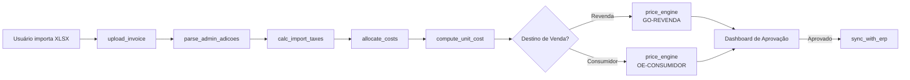

# Especificação do Sistema de Custos, Tributos e Formação de Preço

**Objetivo-chave:** transformar as planilhas anexas em uma aplicação integrada que receba dados de importação, calcule custos/tributos, proponha preços de venda e gere relatórios de suporte à tomada de decisão.

## 1. Arquitetura Geral

| Camada | Responsabilidade | Principais tecnologias sugeridas |
| :-- | :-- | :-- |
| Apresentação (UI) | Tela web responsiva para upload de arquivos, dashboards, formulários de manutenção de cadastros | React + TypeScript |
| API de Negócio | Orquestração de processos, exposição REST/GraphQL | Node.js + NestJS ou Python + FastAPI |
| Serviços de Domínio | Módulos isolados de cálculos, validações e integrações | Python (pandas, NumPy) |
| Persistência | Dados normalizados e versionados | PostgreSQL (tabelas relacionais) |
| Integração | Conversão Excel→JSON, leitura SEFAZ/Receita, exportação ERP | Celery/RabbitMQ ou AWS SQS + Lambda |
| Observabilidade | Logging, métricas e alertas | ELK Stack, Prometheus/Grafana |

## 2. Modelo de Dados Essencial

1. **Produto** (SKU, NCM, descrição, peso, unid.‐cx, …)
2. **AdiçãoDI** (nº adição, NCM, peso líq., base de cálculo, alíq. II/IPI/PIS/COFINS/ICMS, frete, MVA, …)
3. **Estado** (UF, ICMS entrada, ICMS venda, FP, MVA, crédito presumido, …)
4. **Custos** (id_produto, adição, custo_CIF, custos_nacionalização, impostos_DI, custo_total)
5. **PreçoVenda** (cenário, destino, margem, comissão, preço_s_IPI, preço_c_IPI, ST/DIFAL, impostos_saida, lucro)
6. **ParâmetroFiscal** (CEST, MVA interna/interestadual, acordos ICMS, base legal, vigência)
7. **Usuário/Perfil/Auditoria**

Todas as tabelas trazem colunas de *created_at*, *updated_at*, *valid_from* e *valid_to* para versionamento.

## 3. Principais Funções (assinaturas lógicas)

1. **upload_invoice(file: bytes) → InvoiceBatch**
    - Converte XLSX para DataFrames (pandas) e persiste lote.
2. **parse_admin_adicoes(batch_id) → List$AdicaoDI$**
    - Extrai linhas válidas de “ADMIN_Adições”.
3. **calc_import_taxes(adicao: AdicaoDI) → Dict**
    - Aplica II, IPI, PIS, COFINS, SISCOMEX usando alíquotas vigentes.
4. **allocate_costs(batch_id) → None**
    - Projeta frete/seguro/despesas proporcionalmente a peso ou valor.
5. **compute_unit_cost(item_id) → Decimal**
    - (CIF + despesas + impostos) / quantidade.
6. **get_state_params(uf: str, vigencia: date) → StateTaxParam**
7. **price_engine(input: PriceRequest) → PriceResult**
Param.: SKU, destino UF, tipo_cliente (“Revenda”|“Consumidor”), margem, comissão, frete.
Saída: preço sugerido s/IPI, c/IPI, ST/DIFAL, lucro, carga tributária.
8. **generate_report(report_type, filters) → PDF/Excel**
    - Custos, lucros, ranking margens, mapas de carga tributária.
9. **sync_with_erp(payload) → Ack**
    - Envia preço aprovado, custo médio e NCM para o ERP.
10. **audit_log(event, user_id, meta) → None**

## 4. Fluxo do Processo

## 5. Regras de Negócio-chave

1. **Conversão cambial** – usar taxa contrato (sheet ADMIN_CÂMBIO).
2. **Rateio de frete/seguro** – proporcional ao peso líq. da adição.
3. **Crédito Presumido e FP** – aplicar somente quando *estado.base_prodepe > 0* e tipo_cliente = Revenda.
4. **MVA/ST** – buscar NCM+CEST na tabela *ParâmetroFiscal*; se ausente, usar fórmula genérica MVA = (ICMS destino – ICMS origem)/(1 – ICMS origem).
5. **Cálculo de margem** –

$$
\text{Margem} = \frac{\text{Preço s/IPI} - \text{Custo Total}}{\text{Preço s/IPI}}
$$
6. **Carga Tributária Exibida** – soma de IPI + ICMS + PIS + COFINS (+ ST/DIFAL quando aplicável) / preço s/IPI.

## 6. Serviços de Integração Externa

- **Receita WS-NCM**: validação automática de NCM.
- **SEFAZ-MVA**: consulta de pauta ST.
- **Correios/Frete**: estimativa de frete por cep/UF.
- **ERP (Totvs/SAP)**: REST outbound para produtos e preços.

## 7. Segurança \& Governança

- Autenticação via JWT + OAuth2.
- Controle de acesso por perfil (Compras, Fiscal, Pricing, Admin).
- Criptografia em repouso (AES-256, column level para valores sensíveis).
- Logs imutáveis (append-only) com retenção de 5 anos.

## 8. Estratégia de Implantação

1. MVP focado em **custos de importação** e **preço GO-Revenda**.
2. Sprint 2: cenários Consumidor + ST/DIFAL.
3. Sprint 3: integrações ERP + automação de relatórios em PDF.
4. Sprint 4: motor de regras parametrizável (admin web).
5. Sprint 5: testes de performance, hardening e homologação fiscal.

## 9. Testes Essenciais

- **Unitários** para cada fórmula tributária.
- **Massa de regressão** com 10 planilhas reais para comparar resultado antigo × novo.
- **Testes de carga**: 1 milhão de linhas importadas ≤ 3 min.
- **Teste de segurança**: OWASP ZAP, Snyk.

## 10. Entregáveis

1. Documento *OpenAPI* com todos os endpoints.
2. Manual de operação, matriz de perfis.
3. Scripts de migração (Alembic/Flyway).
4. Pacote Helm ou Docker-Compose para deploy on-prem ou AWS ECS.
5. Conjunto de *Jupyter Notebooks* de validação fiscal para auditoria.

**Resultado esperado:** com estes módulos, funções e fluxo, a empresa substituirá as planilhas manuais por um sistema audível, escalável e capaz de atualizar alíquotas ou margens em minutos, eliminando erros de cálculo e reduzindo o tempo de precificação de horas para segundos.

⁂

[^1]: ENTRA-DI-Detalhado-v-4.1.xlsx

